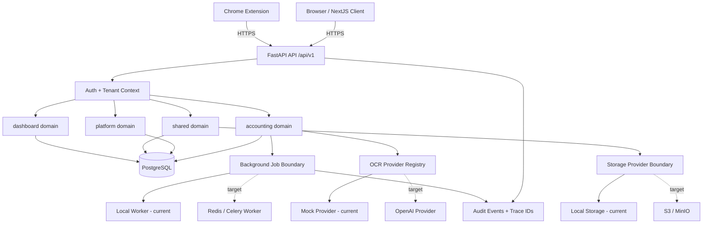

# System Architecture Design: Accounting OCR Platform

## 1. Executive Summary

The **Accounting OCR Platform** is a document intake, OCR, review and export platform for accounting service companies in Vietnam. It supports secure client-company document intake, AI-assisted invoice extraction, human-in-the-loop correction, approval, export batches and auditability.

The project is currently a **FastAPI + NextJS modular monolith**. The intended long-term architecture keeps the modular monolith as the primary application boundary while allowing infrastructure adapters to evolve from local development implementations to production-grade services such as PostgreSQL, S3/MinIO-compatible object storage and Redis-backed workers.

## 2. Architecture Status

This document distinguishes between:

- **Current implementation**: what exists in the codebase now.
- **Target architecture**: the direction that implementation tasks should move toward.
- **Architecture gates**: decisions or contracts that must be resolved before production rollout.

### Current Implementation

- Backend: Python FastAPI modular monolith.
- Frontend: NextJS app shell with accounting, dashboard, AI/OCR and admin pages.
- Database: SQLAlchemy models with Alembic migration backbone.
- Tenant model: row-level `organization_id` filters through repositories and request context.
- Auth: Google SSO callback and JWT issuance exist, but demo header auth is still accepted when bearer auth is absent.
- Storage: local storage provider with a storage abstraction.
- Background work: local background job abstraction and worker script.
- OCR: provider interface exists, but job execution currently directly instantiates the mock provider.
- Audit/observability: trace ID middleware and domain audit events exist.

### Target Architecture

- Backend remains a modular monolith with explicit bounded contexts.
- Storage uses an injected provider boundary: local provider for development, S3/MinIO-compatible provider for production.
- Background jobs use an explicit queue boundary: current local worker for development, Redis/Celery or equivalent durable worker when production scale requires it.
- OCR providers are selected through a registry/factory boundary.
- API responses are DTO-first, stable and safe for frontend consumption.
- Status transitions are enforced by domain lifecycle policy functions, not arbitrary string mutation.
- All list-heavy workflows expose bounded pagination/filter contracts.

## 3. High-Level Architecture



## 4. Bounded Contexts

### `app.core`

Owns cross-cutting infrastructure that must stay framework-level and domain-neutral:

- Configuration.
- Database session wiring.
- Request context and auth provider selection.
- Permission helpers.
- Storage abstraction.
- Trace ID middleware and observability primitives.

Architecture rule: `app.core` must not depend on accounting or platform domain services.

### `app.domains.platform`

Owns identity, organizations, memberships, roles, sessions and audit administration:

- Google SSO callback and profile verification.
- Membership-to-principal resolution.
- JWT/session issuance.
- Admin user management.
- Audit event listing.

Architecture gates:

- Demo header auth must be explicitly environment-gated.
- Production auth must fail closed on missing/invalid bearer tokens.
- Production platform reads should be DB-backed; in-memory demo store usage must be removed or isolated from production endpoints.

### `app.domains.shared`

Owns reusable domain infrastructure:

- File assets.
- File upload validation.
- Background job records.
- Job lifecycle events.

Architecture gates:

- File assets need content hash support for duplicate detection.
- Storage keys must not depend on unsafe original filenames.
- Background jobs should carry correlation IDs and idempotency metadata where applicable.

### `app.domains.accounting`

Owns accounting service company workflows:

- Client companies.
- Accounting documents.
- OCR jobs, results and fields.
- Review/correction and approval.
- Export batches.
- Region OCR.

Architecture gates:

- Document/OCR/export statuses must be controlled by lifecycle policy functions.
- OCR provider selection must use a registry/factory boundary.
- OCR result DTOs must expose field IDs for review while excluding raw provider payload by default.
- Export template serialization must be isolated from document lifecycle and HTTP transport.

### `app.domains.dashboard`

Owns aggregation APIs for tenant-scoped operational metrics:

- Document counts.
- OCR queue and failure counts.
- Review workload counts.
- Export batch counts.
- Audit signal summaries.

Architecture rule: dashboard APIs should use aggregate SQL queries, not unbounded row loading.

## 5. Core Workflows

### 5.1 Auth And Tenant Resolution

Target flow:

1. User signs in through Google SSO or local/demo mode.
2. Backend verifies identity.
3. Backend resolves active membership and role.
4. Backend issues JWT with `user_id`, `organization_id`, role and permissions.
5. API requests derive tenant only from trusted backend-authenticated context.

Production rules:

- Never trust `X-Organization-Id`, `X-User-Id` or `X-Role` headers in production.
- Demo header auth is local/demo-only.
- JWT secret and CORS origins must be environment-driven.
- SSO audit events must not store raw Google ID tokens.

### 5.2 Document Intake

Target flow:

1. Frontend submits multipart upload with file and accounting metadata.
2. Backend validates file size, type, extension and signature.
3. Backend calculates content hash.
4. Backend stores file through storage provider boundary.
5. Backend creates file asset and accounting document metadata.
6. Backend emits audit event with safe metadata only.

Duplicate detection stages:

- Pre-OCR: content hash duplicate detection scoped by organization.
- Post-OCR/review: invoice identity duplicate detection using seller tax code, invoice number, invoice symbol, invoice date and total amount.

Architecture rules:

- File content is never stored in audit events.
- Storage paths cannot be influenced by unsafe original filenames.
- Upload APIs must remain bounded and reject oversize files server-side.

### 5.3 OCR Processing

Target flow:

1. Document is submitted for OCR.
2. OCR job is created with provider name, correlation ID and idempotency context.
3. Background worker claims and executes the job.
4. OCR provider registry resolves the provider.
5. Provider returns normalized fields and confidence values.
6. Accounting domain stores result and fields.
7. Lifecycle policy routes document to the next state.
8. Audit events record job completion or failure without raw provider payload.

Provider boundary:

- `mock`: deterministic local/testing provider.
- `openai`: production-capable provider.
- Future providers must implement the same provider protocol and be registered through the provider registry.

Architecture rules:

- OCR service should not directly instantiate concrete provider classes in core execution flow.
- Unknown provider names fail closed.
- Raw provider payload is backend diagnostic data and is not returned by normal reviewer APIs.

### 5.4 Review And Approval

Target flow:

1. Reviewer opens a paginated `needs_review` queue.
2. Reviewer selects a document and loads OCR result DTO.
3. UI displays field ID, key, value, confidence, source and confidence level.
4. Reviewer edits fields.
5. Backend records correction and audit event.
6. Backend validates required fields.
7. Backend approves OCR result and document through lifecycle policy.

Architecture rules:

- Reviewer queue uses server-side filters and pagination.
- Approval validation happens in backend service, not only in the UI.
- Field correction audit metadata does not include sensitive raw document text unless explicitly classified as safe.

### 5.5 Export

Target flow:

1. User selects approved documents.
2. User selects export template: `json`, `misa` or `fast`.
3. Export service validates tenant, status and template.
4. Serializer maps reviewed fields to deterministic columns.
5. Export artifact is generated or queued.
6. Download endpoint returns a safe file response or expiring download reference.
7. Audit event records creation and download without row contents.

Architecture rules:

- Export serializers are isolated from document lifecycle and HTTP routing.
- Batch document loading uses tenant-scoped batched/projection queries.
- Large exports must be bounded or routed through background jobs.
- CSV/Excel cells must be escaped to prevent spreadsheet formula injection.

### 5.6 Dashboard And Admin Audit

Target flow:

1. Dashboard calls tenant-scoped summary API.
2. Backend computes aggregate counts for documents, OCR queues, failures, review workload, exports and audit events.
3. Admin audit view reads paginated audit events.
4. Audit rendering defaults to safe metadata fields.

Architecture rules:

- Dashboard cards use aggregate queries.
- Audit event lists are paginated.
- Admin UI must not render raw OCR payloads, tokens, file contents or export row contents by default.

## 6. Domain Lifecycle Policy

The accounting domain must own lifecycle transitions for:

- Accounting documents.
- OCR jobs.
- OCR results.
- Export batches.

Direct arbitrary string mutation is not allowed in production paths.

### Document Lifecycle

```text
uploaded -> queued -> processing -> needs_review -> approved -> exported
uploaded -> failed
queued -> failed
processing -> failed
needs_review -> failed
```

Notes:

- `reviewed` may be introduced later if the product needs a separate state between correction completion and final approval.
- `archived` may be introduced later as a terminal retention state.

### OCR Job Lifecycle

```text
queued -> processing -> completed
queued -> processing -> failed
failed -> queued
```

Retry rules must be explicit and idempotent.

### OCR Result Lifecycle

```text
needs_review -> approved
needs_review -> rejected
```

### Export Batch Lifecycle

```text
queued -> processing -> completed
queued -> processing -> failed
completed -> downloaded
```

Small synchronous exports may skip `queued/processing` only if the service still records a valid lifecycle path.

## 7. API Contract Principles

- API base path: `/api/v1`.
- Routers expose DTO schemas only.
- Lists must include bounded pagination contracts.
- Tenant is inferred from authenticated backend context.
- Frontend must not pass organization IDs for tenant scoping.
- OCR result detail must expose field IDs for correction APIs.
- Raw provider payloads are excluded from normal frontend responses.
- Error responses should use stable error `code` values.

### Pagination

Offset pagination is acceptable for current scale:

- `limit`: bounded default, with server-side maximum.
- `offset`: non-negative integer.
- Optional filters: `status`, `client_company_id`, `accounting_period`, confidence level where supported.

Cursor pagination can be introduced later if queue size or ordering requirements outgrow offset pagination.

## 8. Data Model And Migration Principles

Every significant persistence change must include:

- SQLAlchemy model update.
- Alembic migration.
- Seed/demo data update if needed.
- Tests for tenant isolation and backward-compatible defaults.

Required model evolution:

- Add content hash support for file assets or accounting documents.
- Add invoice identity fields or normalized OCR/reviewed field indexes that can support duplicate detection.
- Add export artifact metadata if exports produce stored files.
- Add correlation ID storage for background jobs and/or audit events if needed for traceability.

## 9. Security Architecture

### Multi-Tenant Isolation

- Every query and mutation must include backend-resolved `organization_id`.
- Cross-tenant IDs must return not found or permission denied without revealing existence.
- Tests must cover tenant isolation for upload, review, approval, export, audit and dashboard APIs.

### Auth And RBAC

- Production mode fails closed without valid bearer auth.
- Demo header auth is local/demo-only.
- Role/permission checks are required for upload, review, approval, export and admin audit access.

### Data Minimization

Never store or render these values in normal audit or frontend payloads:

- Raw file bytes.
- Raw OCR provider prompts/responses.
- Google ID tokens.
- Bearer tokens.
- Export row contents.
- Sensitive invoice text not required for the current UI action.

### Upload Safety

- Validate size, MIME, extension and file signature server-side.
- Sanitize original filenames.
- Generate storage keys from safe IDs.
- Calculate content hash.
- Reject duplicate file hashes per tenant where policy requires.

## 10. Performance And Reliability

### Query Performance

- Reviewer queues, document lists, audit lists and dashboard cards must be bounded.
- Dashboard metrics should use aggregate SQL queries.
- Export generation must avoid N+1 document fetches.
- Common filters should be backed by indexes: `organization_id`, `client_company_id`, `status`, `ocr_status`, `accounting_period`, created timestamp and export batch IDs.

### Background Reliability

- OCR and large exports should be retryable and idempotent.
- Background jobs must carry enough context to continue without request scope.
- Worker logs and audit events should include correlation IDs.
- External provider failure should mark jobs/documents predictably and safely.

### Export Reliability

- Small exports can be synchronous if bounded.
- Large exports should be background jobs.
- Artifact creation must be idempotent or protected by idempotency keys.

## 11. Observability

Current:

- HTTP trace ID middleware.
- Structured request log.
- Audit events for several domain actions.

Target:

- Correlation ID propagated from request to background job to audit event.
- Audit event catalog with safe metadata fields.
- Dashboard metrics for OCR queue, OCR failures, needs review, exports and audit volume.
- Worker logs include job ID, document ID, organization ID and correlation ID.

## 12. Architecture Decision Records

These ADRs summarize current decisions. If implementation changes them, update this section.

### ADR-001: Modular Monolith First

- Context: The product is domain-rich but not yet large enough to justify microservices.
- Decision: Keep one FastAPI modular monolith with explicit domain packages.
- Alternatives: Separate services per domain; serverless functions per workflow.
- Trade-offs: Faster development and simpler transactions now; requires strict module boundaries to avoid coupling.
- Impact: New features must fit `core`, `platform`, `shared`, `accounting` or `dashboard`.

### ADR-002: Local Worker Now, Durable Queue Later

- Context: Docs previously described Celery/Redis, while code has a local background job abstraction.
- Decision: Treat local worker as current implementation and keep a queue boundary for future Celery/Redis.
- Alternatives: Adopt Celery/Redis immediately; run OCR synchronously.
- Trade-offs: Local worker is simpler for MVP; durable queue is required for production reliability and retries at scale.
- Impact: Job code must not depend on request scope and must be idempotent.

### ADR-003: Storage Provider Boundary

- Context: Code uses local storage, while target architecture needs private object storage.
- Decision: Keep storage provider abstraction. Local provider is development/default; S3/MinIO provider is production target.
- Alternatives: Direct local filesystem usage; direct S3 usage in services.
- Trade-offs: Provider abstraction adds a small layer but prevents storage coupling.
- Impact: Services depend on `StorageProvider`, not concrete storage backends.

### ADR-004: OCR Provider Registry

- Context: OCR service currently directly instantiates the mock provider.
- Decision: Move toward provider registry/factory resolving `mock`, `openai` and future providers.
- Alternatives: Inline provider creation; separate OCR service per provider.
- Trade-offs: Registry keeps service logic stable and makes provider selection testable.
- Impact: Unknown provider names fail closed; provider raw payload remains backend-only by default.

### ADR-005: Export Serializer Boundary

- Context: Export service will support JSON, MISA and FAST formats.
- Decision: Separate template serializers from export batch lifecycle and HTTP download transport.
- Alternatives: Hard-code templates in router/service.
- Trade-offs: More structure, but easier tests and safer expansion.
- Impact: Adding new export formats should not affect review or document lifecycle logic.

## 13. Open Architecture Gates

These gates are tracked in `docs/PLAN.md` and must be resolved before production readiness:

- AG-1: Record architecture ADRs for worker/storage/OCR/export divergence.
- AG-2: Define domain lifecycle policy.
- AG-3: Define OCR provider registry boundary.
- AG-4: Define file asset and duplicate detection data model.
- AG-5: Stabilize API contract and pagination architecture.
- AG-6: Define export architecture boundary.
- AG-7: Remove or isolate demo store from production platform APIs.
- AG-8: Define correlation ID propagation across async work.
