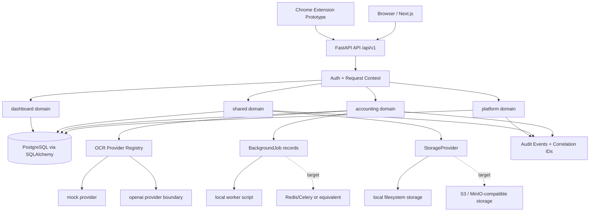

# Architecture: Accounting OCR Platform

Last updated: 2026-05-29

## 1. Executive Summary

Accounting OCR Platform is a modular document intake, OCR, human review and
export platform for accounting service teams. The source code currently
implements a FastAPI backend, a Next.js frontend, a Chrome extension prototype,
database migrations, tests and architecture/planning documentation.

The current codebase should be treated as a modular monolith MVP. It already has
clear bounded contexts, tenant-scoped repositories, upload validation, OCR
provider abstraction, lifecycle policies, field-level OCR result contracts,
export templates, audit events and a reviewer queue UI shell. It is not yet a
production-ready deployment because authentication is still demo-friendly,
workers/storage are local, reviewer correction UI is incomplete, export artifact
download is simplified, and some list/admin APIs still need stronger pagination
and aggregate-query hardening.

## 2. Requirement Mapping To Assignment Scope

| Assignment Requirement | Architecture Feature | Current Source Evidence | Production Notes |
| --- | --- | --- | --- |
| Google SSO | Google SSO Authentication | `auth_router.py`, `google_sso.py`, `auth_membership_service.py` | Needs production fail-closed mode and strict Google client configuration. |
| Admin authorization, history and statistics | Admin And Security Management, Dashboard And Operational Analytics | Platform admin router, audit service, dashboard domain | Audit/admin pagination and role-specific dashboard hardening remain open. |
| Import PDF/JPG/PNG invoices | Accounting Document Intake | Multipart upload endpoint, storage validation, file service | Add antivirus scanning boundary before production. |
| Select company, invoice type and category | Client Company Management, Document Metadata & Classification | `client_company_id`, `document_type`, `category`, `accounting_period` | Add richer metadata validation and controlled vocabularies. |
| OCR invoice extraction | OCR Job Processing | OCR provider registry, OCR job/result/field models | Durable worker and provider timeout/retry policies remain open. |
| OCR result review UI | Reviewer Queue And Field Correction | `/accounting/review`, OCR result DTO with field IDs | Complete field editing, approval action and correction history UI. |
| Send data to accounting/business software | Export Batch Management | JSON, MISA-style CSV and FAST-style CSV serializers | Implement real artifact download or expiring storage reference. |
| Chrome extension with bounding boxes | Region OCR Extension Workflow | `extension/chrome`, region OCR endpoint | Requires separate extension security review before release. |

## 3. Current Source State

### Repository Layout

```text
backend/       FastAPI app, SQLAlchemy models, Alembic migrations, tests, worker script
frontend/      Next.js app for intake, dashboard, review queue, admin and AI pages
extension/     Chrome extension prototype for page/region OCR capture
docs/          Architecture, API contract and implementation plan
infra/         Placeholder for future infrastructure code
scripts/       Placeholder for project-level scripts
```

### Implemented Runtime Components

- Backend API: FastAPI app mounted under `/api/v1`.
- Frontend app: Next.js app router with pages for overview, dashboard,
  accounting intake, accounting review queue, AI and admin.
- Database layer: SQLAlchemy async models and Alembic migrations.
- Auth context: bearer JWT support plus demo header fallback.
- Tenant model: `organization_id` propagated through request context and
  repository filters.
- Upload path: multipart upload with server-side size, MIME, extension and file
  signature validation.
- File storage: local filesystem provider behind `StorageProvider`.
- Duplicate detection: per-tenant file content hash support.
- OCR: provider registry with mock and OpenAI-capable provider boundary.
- Review contract: OCR result exposes both legacy `fields` and `field_items`
  with stable field IDs.
- Export: JSON, MISA-style CSV and FAST-style CSV template serializers.
- Audit/traceability: audit events, HTTP trace ID middleware and correlation IDs
  for OCR/background/export flows.
- Test suite: backend non-integration tests for lifecycle, contracts, upload
  validation, duplicate handling, correlation IDs, exports, permissions and
  platform boundaries.

### Known Local Artifacts

- `frontend/node_modules/` and `frontend/.next/` may exist locally after install
  and build, but are ignored by git.
- `.github/workflows/` is ignored because the current GitHub token cannot push
  workflow files without `workflow` scope.

## 4. High-Level Architecture



## 5. Solution Feature Requirements

This section maps the architecture to business outcomes, compliance needs and
operational acceptance criteria. It is intentionally written as a portfolio-level
solution architecture view, not only a module inventory.

## Feature: Google SSO Authentication

### Business Description

Allows users to sign in with Google, maps verified identity to platform
membership and issues a backend session context for tenant-scoped operations.

### Job To Be Done (JTBD)

**When** an employee or administrator accesses the platform

**I want** authentication to happen through Google SSO and organization
membership resolution

**So that** only authorized users can access client documents, OCR workflows and
administrative actions.

### Compliance & Standards

- OAuth/OIDC ID token verification.
- Tenant-aware membership resolution.
- RBAC and least privilege.
- Login audit trail.
- Fail-closed production authentication.

### Acceptance Criteria

- User can authenticate through Google callback.
- Backend verifies Google identity before issuing platform access.
- Email/user identity maps to an active membership and organization.
- Unknown or inactive users are rejected.
- JWT includes user, organization, role and permissions.
- Login success/failure is auditable.
- Demo header authentication is disabled or explicitly gated in production.

### Non-Functional Requirements

- Token verification should complete within P95 < 700ms excluding Google network
  instability.
- Session issuance must be stateless and horizontally scalable.
- JWT secret and Google client ID must be environment-managed.
- Auth failures must not reveal whether a tenant or user exists.

### Business KPI

- SSO login success rate > 99%.
- Unauthorized access attempts blocked = 100%.
- Average login completion time < 3 seconds.
- Login audit coverage = 100%.

### Key Risks And Mitigations

- Risk: Demo auth accidentally accepted in production.
  Mitigation: environment-gated auth provider selection and fail-closed
  production mode.
- Risk: Invalid Google token accepted.
  Mitigation: strict ID token verification against configured client ID.
- Risk: User has no valid membership.
  Mitigation: membership resolution before JWT issuance.
- Risk: Token leakage in logs.
  Mitigation: never store raw ID tokens or bearer tokens in audit metadata.

### Architecture Ownership

- Backend owner: `app.domains.platform.auth_router`, `google_sso.py`,
  `auth_membership_service.py`.
- Auth context owner: `app.core.context`, `app.core.session`.
- Data owner: `User`, `Membership`, `Role`, `LoginEvent`.
- API owner: platform auth callback endpoints.

## Feature: Client Company Management

### Business Description

Allows an accounting service organization to manage the client companies whose
documents, invoices and accounting periods are processed in the platform.

### Job To Be Done (JTBD)

**When** an accounting service team receives work from a new or existing client
company

**I want** a tenant-scoped client-company record with tax and identity metadata

**So that** uploaded documents, OCR results, review queues and exports can be
organized by the correct client relationship.

### Compliance & Standards

- Tenant isolation.
- RBAC for create/update operations.
- Audit trail for client-company mutations.
- Unique client tax code policy per organization.

### Acceptance Criteria

- Admin or employee can create a client-company record.
- Client-company list only returns records for the current organization.
- Duplicate tax code handling is scoped to the organization.
- Document upload requires a client-company association.
- Client-company APIs do not accept caller-supplied organization ownership.

### Non-Functional Requirements

- Client-company list must be bounded before production-scale rollout.
- Common lookup by `organization_id` and `tax_code` must be indexed.
- Read latency target: P95 < 300ms for normal tenant workloads.
- Write latency target: P95 < 700ms excluding database cold starts.

### Business KPI

- Client-company lookup success rate > 99%.
- Duplicate client setup incidents < 1% of new client records.
- Average client-company setup time < 2 minutes.
- Client metadata correction rate decreases quarter over quarter.

### Key Risks And Mitigations

- Risk: Duplicate or conflicting client identity.
  Mitigation: tenant-scoped tax-code uniqueness and future review workflow for
  client merges.
- Risk: Cross-tenant data exposure.
  Mitigation: backend-resolved organization context and repository filtering.
- Risk: Unbounded client lists at scale.
  Mitigation: add explicit pagination and indexed lookup filters before
  production scale.

### Architecture Ownership

- Backend owner: `app.domains.accounting.client_company_service`.
- Data owner: `AccountingClientCompany`.
- API owner: `/api/v1/accounting/client-companies`.
- Frontend owner: accounting intake surfaces.

## Feature: Accounting Document Intake

### Business Description

Allows users to upload invoices and supporting accounting documents with client,
period, type and category metadata.

### Job To Be Done (JTBD)

**When** an accounting team receives a document for processing

**I want** to upload it with safe metadata validation and duplicate detection

**So that** OCR and review workflows start from trusted, tenant-scoped records.

### Compliance & Standards

- Tenant isolation.
- RBAC for upload and document creation.
- Upload size, MIME, extension and file signature validation.
- Safe filename policy.
- Duplicate file detection by content hash.
- Audit trail without raw file bytes.

### Acceptance Criteria

- Admin or employee can upload PDF, JPEG or PNG documents.
- Oversized files are rejected server-side.
- MIME/extension/signature mismatches are rejected.
- Duplicate file content returns a conflict within the same organization.
- Stored file paths are derived from safe IDs and sanitized filenames.
- Created documents include file asset metadata and initial lifecycle state.

### Non-Functional Requirements

- Max upload size is bounded by configuration.
- Upload reading must remain chunked and memory-aware.
- Storage provider must be replaceable without changing accounting services.
- Upload rejection should fail before any accounting document row is created.

### Business KPI

- Upload success rate > 99% for supported file types.
- Duplicate upload prevention rate tracked monthly.
- Average successful upload processing time < 5 seconds for files within limit.
- Invalid upload rejection accuracy > 99%.

### Key Risks And Mitigations

- Risk: Malware or malicious document upload.
  Mitigation: MIME, extension and signature validation plus antivirus scanning
  boundary for production.
- Risk: Oversized file or resource exhaustion attack.
  Mitigation: streaming size guard and configured max upload size.
- Risk: Corrupted PDF or image input.
  Mitigation: file signature validation and controlled rejection codes.
- Risk: Duplicate OCR cost from repeated uploads.
  Mitigation: content hash duplicate detection before OCR.

### Architecture Ownership

- Backend owner: `AccountingDocumentService`, `FileService`.
- Storage owner: `StorageProvider`, `LocalStorageProvider`.
- Data owner: `AccountingDocument`, `FileAsset`.
- API owner: `POST /api/v1/accounting/documents/upload`.
- Frontend owner: `frontend/app/accounting/create-document-form.tsx`.

## Feature: Document Metadata & Classification

### Business Description

Classifies each accounting document by client company, accounting period,
document type, business category and invoice identity so OCR, review, duplicate
detection and export workflows can apply the right policies.

### Job To Be Done (JTBD)

**When** a document enters the platform

**I want** required accounting metadata captured and normalized

**So that** downstream OCR, review and export processes can route and validate
the document correctly.

### Compliance & Standards

- Tenant isolation.
- Controlled metadata vocabulary for document type and category.
- Accounting period validation.
- Invoice identity support for duplicate detection.
- Audit trail for metadata changes.

### Acceptance Criteria

- Document metadata includes `client_company_id`, `document_type`, `category`
  and `accounting_period`.
- Invoice identity fields can store seller tax code, invoice number, invoice
  symbol, invoice date and total amount.
- Metadata belongs to backend-resolved organization context.
- Document list supports status, client company and accounting period filters.
- Metadata can support post-OCR duplicate detection policies.

### Non-Functional Requirements

- Common filters must be indexed.
- Metadata validation should reject malformed accounting periods before export.
- Metadata updates should remain auditable.
- Classification should not require re-uploading the file.

### Business KPI

- Document classification completion rate > 99%.
- Metadata correction rate < 5% after intake process stabilizes.
- Duplicate invoice detection coverage > 95% after OCR promotion is completed.

### Key Risks And Mitigations

- Risk: Misclassified document causes wrong export mapping.
  Mitigation: controlled categories and review validation before approval.
- Risk: Invoice duplicate not detected.
  Mitigation: invoice identity indexes and post-OCR duplicate policy.
- Risk: Caller spoofs organization metadata.
  Mitigation: organization is derived only from auth context.

### Architecture Ownership

- Backend owner: `AccountingDocumentService`.
- Data owner: `AccountingDocument`.
- API owner: document create/upload/list endpoints.
- Frontend owner: accounting intake and review surfaces.

## Feature: OCR Job Processing

### Business Description

Creates OCR jobs for uploaded accounting documents, executes OCR through a
provider boundary and persists normalized extraction results.

### Job To Be Done (JTBD)

**When** a document is ready for extraction

**I want** OCR processing to run through a controlled provider abstraction

**So that** the platform can switch between mock, OpenAI or future providers
without changing review and export workflows.

### Compliance & Standards

- Provider registry and fail-closed unknown provider behavior.
- State machine governance for document and OCR job transitions.
- Correlation ID propagation.
- Audit trail for request, completion and failure.
- Raw provider payload is backend diagnostic data only.

### Acceptance Criteria

- OCR request creates an OCR job and a background job record.
- OCR execution resolves provider through the registry.
- Invalid provider names fail closed.
- OCR completion creates result and field rows.
- OCR failure moves job and document to predictable failed states.
- Normal OCR result API does not expose raw provider payload.

### Non-Functional Requirements

- OCR jobs must carry enough context to execute outside request scope.
- Job records must include attempts and correlation ID.
- Future durable worker implementation must support retries and idempotent
  claiming.
- External provider timeout/failure must not leave invalid lifecycle state.

### Business KPI

- OCR automation rate > 80% after review workflow stabilization.
- Average OCR processing time < 30 seconds for normal documents.
- OCR success rate > 99%.
- OCR retry rate < 5%.
- Provider-related incident recovery time < 1 business hour.

### Key Risks And Mitigations

- Risk: OCR provider outage.
  Mitigation: provider registry, fail-closed errors, retry policy and future
  multi-provider routing.
- Risk: OCR accuracy degradation.
  Mitigation: confidence scoring, human review queue and correction audit.
- Risk: Vendor lock-in.
  Mitigation: provider protocol and registry boundary.
- Risk: Duplicate OCR processing cost.
  Mitigation: duplicate detection, idempotency policy and future OCR result
  caching.

### Architecture Ownership

- Backend owner: `AccountingOcrService`.
- Provider owner: `ocr_provider.py`.
- Job owner: `BackgroundJobService`.
- Data owner: `AccountingOcrJob`, `AccountingOcrResult`,
  `AccountingOcrField`, `BackgroundJob`.
- API owner: OCR job request and execute endpoints.

## Feature: Reviewer Queue And Field Correction

### Business Description

Allows reviewers to find documents needing human validation, inspect extracted
fields, correct values and approve OCR results.

### Job To Be Done (JTBD)

**When** OCR confidence is low or accounting fields require validation

**I want** a reviewer queue and field-level correction workflow

**So that** only verified accounting data moves to approval and export.

### Compliance & Standards

- Tenant isolation.
- RBAC for field updates and approval.
- State machine governance for OCR result and document approval.
- Field-level audit metadata.
- DTO contract exposing field IDs and excluding raw OCR payload.

### Acceptance Criteria

- Reviewer queue loads `needs_review` documents from a bounded API query.
- Queue supports client-company and accounting-period filters.
- Selecting a document loads OCR result detail.
- OCR result includes `field_items` with `id`, `key`, `value`, `confidence`
  and `source`.
- Field update endpoint records manual correction source and audit event.
- Invalid cross-tenant field/result IDs are not exposed.
- Approval is rejected for invalid lifecycle transitions.

### Non-Functional Requirements

- Review queue must not fetch all documents and filter only in the browser.
- Default queue page size must be bounded.
- Field detail payload must exclude raw provider payload.
- Target queue read latency: P95 < 500ms for normal tenant workloads.
- Future correction history should support pagination.

### Business KPI

- Manual review workload reduced by 70% versus fully manual processing.
- Average review time per document < 2 minutes.
- Reviewer backlog < 1 business day.
- Review SLA breach rate < 5%.
- Field correction audit coverage = 100% for manual edits.

### Key Risks And Mitigations

- Risk: Review backlog growth.
  Mitigation: queue filters, dashboard metrics and SLA alert queue.
- Risk: Incorrect manual correction.
  Mitigation: field-level audit and future correction history.
- Risk: Approval of incomplete OCR data.
  Mitigation: backend approval validation and lifecycle policy.
- Risk: Reviewer sees cross-tenant result.
  Mitigation: tenant-scoped repository access for results and fields.

### Architecture Ownership

- Backend owner: `AccountingOcrService`, `AccountingDocumentRepository`.
- Data owner: `AccountingOcrResult`, `AccountingOcrField`,
  `AccountingDocument`.
- API owner: document list, OCR result, field update and OCR approval endpoints.
- Frontend owner: `frontend/app/accounting/review`.

## Feature: Export Batch Management

### Business Description

Allows approved accounting documents to be grouped and exported in accounting
system-friendly templates. This completes the assignment workflow by preparing
verified OCR data for downstream accounting or business software rather than
expanding the product beyond the intake-to-accounting handoff scope.

### Job To Be Done (JTBD)

**When** reviewed documents are ready for downstream accounting systems

**I want** to export approved records in a controlled template

**So that** accounting teams can transfer verified data without manual
reformatting.

### Compliance & Standards

- RBAC for export creation and download.
- Tenant isolation for all exported documents.
- Approved-only export policy.
- Export template allowlist.
- Spreadsheet formula injection protection.
- Audit trail for export batch creation.

### Acceptance Criteria

- Export rejects unknown template names.
- Export rejects non-approved documents.
- Export batch is tenant-scoped and correlated.
- Export items are recorded per document.
- JSON, MISA-style CSV and FAST-style CSV serializers are isolated from HTTP
  routing.
- CSV cells that could execute formulas are escaped.

### Non-Functional Requirements

- Small exports may run synchronously only while bounded.
- Large exports must move to background jobs.
- Export generation should avoid N+1 document fetches before production scale.
- Download should become a file response or expiring object-storage reference.

### Business KPI

- Export success rate > 99.5%.
- Export generation time < 1 minute for 1,000 documents after batch query
  optimization.
- Export format defect rate < 0.5%.
- Duplicate export incident rate < 1%.

### Key Risks And Mitigations

- Risk: Wrong accounting format.
  Mitigation: serializer isolation, template allowlist and contract tests.
- Risk: Spreadsheet formula injection.
  Mitigation: CSV cell escaping.
- Risk: Duplicate export.
  Mitigation: export batch identity, audit trail and future idempotency keys.
- Risk: Large export timeout.
  Mitigation: move large exports to background jobs and stored artifacts.

### Architecture Ownership

- Backend owner: `AccountingExportService`.
- Template owner: `export_templates.py`.
- Data owner: `AccountingExportBatch`, `AccountingExportItem`.
- API owner: `/api/v1/accounting/export-batches`.

## Feature: Dashboard And Operational Analytics

### Business Description

Provides role-aware operational visibility into document intake, OCR workload,
review workload, export status and audit activity.

### Job To Be Done (JTBD)

**When** an operator or administrator opens the platform

**I want** to see the most important accounting workflow metrics

**So that** I can prioritize queue work, detect failures and monitor throughput.

### Compliance & Standards

- Tenant isolation.
- Role-based visibility.
- Read-only dashboard access.
- Safe aggregation without raw document or OCR payloads.

### Acceptance Criteria

- Dashboard metrics are scoped to current organization.
- Dashboard does not expose raw OCR provider payload or file content.
- Metrics cover document status, OCR queue/failure state, review workload and
  exports as the product matures.
- Admin-only operational data is not visible to lower roles.

### Non-Functional Requirements

- Dashboard target load time: < 1s for normal tenant workloads.
- Aggregate SQL queries should be used instead of row-by-row processing.
- Dashboard endpoints must avoid unbounded list loading.

### Business KPI

- Dashboard availability > 99.9% during business hours.
- Operational KPI freshness < 5 minutes for normal workflows.
- OCR/review backlog visibility coverage = 100% for active tenant documents.
- Admin decision latency reduced through summary metrics.

### Key Risks And Mitigations

- Risk: Slow dashboard due to row-by-row aggregation.
  Mitigation: aggregate SQL and bounded query contracts.
- Risk: Sensitive data leakage through metrics.
  Mitigation: role-based visibility and aggregate-only payloads.
- Risk: Misleading stale metrics.
  Mitigation: timestamped metrics and future refresh indicators.

### Architecture Ownership

- Backend owner: `app.domains.dashboard`.
- Data owners: accounting, shared and platform aggregate sources.
- Frontend owner: `frontend/app/dashboard`.

## Feature: Admin And Security Management

### Business Description

Allows administrators to manage users, observe audit events and control access
to platform capabilities.

### Job To Be Done (JTBD)

**When** the organization adds staff or changes responsibilities

**I want** centralized user, role and audit management

**So that** access remains least-privilege and privileged actions remain
traceable.

### Compliance & Standards

- RBAC.
- Least privilege.
- Tenant isolation.
- Audit logging for privileged operations.
- JWT-based authentication target.
- Demo authentication must be local/development-only.

### Acceptance Criteria

- Admin can list users in the current organization.
- Admin can create user records.
- Admin can request password reset.
- Admin can view audit events for the current organization.
- Non-admin roles are rejected from admin endpoints.
- Organization listing is DB-backed and scoped to current context.

### Non-Functional Requirements

- 100% of privileged actions must be auditable before production.
- Audit lists must add explicit pagination before production scale.
- Production authentication must fail closed without a valid bearer token.
- Secret and JWT configuration must be environment-managed.

### Business KPI

- 100% privileged action audit coverage.
- Unauthorized admin access attempts blocked = 100%.
- User provisioning time < 5 minutes.
- Audit retrieval time P95 < 700ms after pagination/index hardening.

### Key Risks And Mitigations

- Risk: Privilege escalation.
  Mitigation: RBAC, least privilege and permission tests.
- Risk: Demo auth accidentally enabled in production.
  Mitigation: environment-gated auth provider selection and fail-closed
  production mode.
- Risk: Audit log growth slows admin views.
  Mitigation: pagination, indexes and retention policy.

### Architecture Ownership

- Backend owner: `app.domains.platform`.
- Auth owner: `app.core.context`, `app.core.session`,
  `auth_membership_service.py`.
- Data owner: `User`, `Role`, `Membership`, `AuditEvent`.
- Frontend owner: `frontend/app/admin`.

## Feature: Region OCR Extension Workflow

### Business Description

Provides a prototype path for capturing selected page or screen regions and
sending them to the backend for OCR extraction.

### Job To Be Done (JTBD)

**When** a user needs OCR from a selected region rather than a full uploaded
document

**I want** a browser-assisted region capture workflow

**So that** ad hoc document snippets can be extracted without disrupting the
main intake pipeline.

### Compliance & Standards

- Tenant isolation.
- RBAC for region OCR endpoint.
- Explicit region bounding boxes.
- Audit metadata without raw sensitive content by default.

### Acceptance Criteria

- Chrome extension prototype loads popup, background and content scripts.
- Backend accepts region OCR requests for a tenant-scoped document.
- Region request includes page and bounding box coordinates.
- Region OCR response returns text, confidence and box metadata.

### Non-Functional Requirements

- Region OCR should remain bounded by number of regions per request before
  production.
- Browser extension package requires separate security review before release.
- Region OCR should reuse OCR provider boundaries where practical.

### Business KPI

- Region OCR completion time < 10 seconds for bounded selections.
- Region OCR user task completion rate > 95% after UX validation.
- Extension-origin OCR errors < 2% of region OCR requests.

### Key Risks And Mitigations

- Risk: Browser extension captures unintended sensitive content.
  Mitigation: explicit user selection, bounded region payloads and extension
  security review.
- Risk: Region OCR bypasses normal document governance.
  Mitigation: require tenant-scoped document context and RBAC.
- Risk: Large region batches cause provider cost spikes.
  Mitigation: per-request region limits and provider cost controls.

### Architecture Ownership

- Backend owner: `RegionOcrService`.
- API owner: `POST /api/v1/accounting/documents/{document_id}/region-ocr`.
- Extension owner: `extension/chrome`.

## 6. Business Capability Matrix

| Capability | Primary KPI | Primary Risk | Mitigation | Owner |
| --- | --- | --- | --- | --- |
| Google SSO Authentication | Login success rate > 99% | Demo auth or invalid token acceptance | Fail-closed production auth and ID token verification | Platform domain |
| Client Company Management | Duplicate setup incidents < 1% | Conflicting client identity | Tenant-scoped uniqueness and merge review | Accounting domain |
| Document Metadata & Classification | Classification completion rate > 99% | Wrong classification or duplicate invoice | Controlled metadata and invoice identity indexes | Accounting domain |
| Document Intake | Upload success rate > 99% | Malicious or oversized upload | Validation, size limits and storage boundary | Accounting + Shared domains |
| OCR Processing | Automation rate > 80% | Provider failure or accuracy drop | Provider registry, retry policy and review queue | Accounting domain |
| Review Workflow | Review SLA < 4 business hours | Backlog growth | Queue filters, dashboard metrics and SLA alerting | Accounting + Dashboard domains |
| Export | Export success rate > 99.5% | Template or formula-injection errors | Serializer isolation, allowlist and CSV escaping | Accounting domain |
| Administration | 100% privileged actions audited | Privilege escalation | RBAC, least privilege and audit trail | Platform domain |
| Dashboard | Dashboard load < 1s | Slow aggregate queries | Aggregate SQL and bounded endpoints | Dashboard domain |
| Region OCR | Region OCR < 10s | Sensitive region capture | Explicit selection, RBAC and extension review | Accounting + Extension |

## 7. Technical Deep Dive Per Feature

This section proves how each feature is expected to operate at production-grade
quality. Items marked as current describe source code that exists now; target
items describe required hardening before production rollout.

## Technical Deep Dive: Google SSO Authentication

### Processing Flow

1. User starts Google sign-in from the frontend.
2. Google returns an ID token to the backend callback flow.
3. Backend verifies ID token according to configured verifier mode.
4. Backend maps verified email or subject to a platform user.
5. Backend resolves active organization membership and role.
6. Backend creates JWT with `user_id`, `organization_id`, role and permissions.
7. Backend records login audit metadata without raw tokens.
8. Frontend uses bearer token for subsequent API requests.

### Data Model

- `User`
- `Organization`
- `Membership`
- `Role`
- `Permission`
- `LoginEvent`

### API Contract

- Platform Google auth callback endpoint.
- `GET /api/v1/me`
- Authenticated API requests with bearer JWT.

### Validation Rules

- ID token must be verified against configured Google client ID in production.
- User must map to an active membership.
- Role and permissions come from backend membership state.
- Production mode must not trust demo headers.

### Security Controls

- Fail-closed bearer auth target.
- JWT signing with environment-managed secret.
- RBAC/permission dependencies on protected endpoints.
- No raw Google ID tokens in audit or logs.

### Performance Controls

- Stateless JWT validation for normal requests.
- Membership lookup indexed by organization/user relationships.
- Optional future session cache for high-volume tenants.

### Failure Handling

- Invalid token -> 401.
- Missing membership -> 403 or 401 without tenant disclosure.
- Inactive user -> 403.
- Google verifier unavailable -> fail closed in production.

### Test Cases

- Reject invalid Google token.
- Reject user without membership.
- Issue JWT with correct organization and role.
- Audit successful login.
- Production mode rejects demo headers.

## Technical Deep Dive: Client Company Management

### Processing Flow

1. Admin or employee submits client company metadata.
2. Backend validates authenticated context and role.
3. Backend applies current `organization_id` from request context.
4. Repository checks tenant-scoped tax-code uniqueness.
5. Client company row is created.
6. Audit event records mutation metadata.
7. Document intake can reference the client company.

### Data Model

- `AccountingClientCompany`
- `AccountingDocument`
- `AuditEvent`

### API Contract

- `GET /api/v1/accounting/client-companies`
- `POST /api/v1/accounting/client-companies`

### Validation Rules

- Caller cannot provide `organization_id`.
- Tax code uniqueness is scoped by organization.
- Document upload requires a valid client company reference.
- Future archive/soft-delete should prevent hard delete when documents exist.

### Security Controls

- RBAC on write endpoints.
- Tenant-scoped repository queries.
- Audit trail for mutations.

### Performance Controls

- Index on `(organization_id, tax_code)`.
- Add pagination before production-scale client lists.
- Avoid document-count N+1 when showing client summaries.

### Failure Handling

- Duplicate tax code -> conflict.
- Unauthorized role -> 403.
- Invalid client reference during upload -> 404 or validation error.

### Test Cases

- Create client company as admin/employee.
- Reject duplicate tax code in same organization.
- Allow same tax code in different organization if legally valid.
- Ensure list does not return cross-tenant clients.
- Reject caller-supplied organization ownership.

## Technical Deep Dive: Document Intake & Metadata Classification

### Processing Flow

1. User chooses client company, accounting period, document type and category.
2. Frontend uploads multipart file.
3. Backend validates auth/RBAC.
4. Backend reads upload in bounded chunks.
5. Backend validates size, MIME, extension and file signature.
6. Backend sanitizes original filename.
7. Backend calculates content hash.
8. Backend checks duplicate hash in the same organization.
9. Backend stores bytes through `StorageProvider`.
10. Backend creates `FileAsset` and `AccountingDocument`.
11. Backend records audit metadata and future `DocumentUploaded` event.

### Data Model

- `AccountingDocument`
- `FileAsset`
- `AccountingClientCompany`
- `AuditEvent`

### API Contract

- `POST /api/v1/accounting/documents/upload`
- `POST /api/v1/accounting/documents`
- `GET /api/v1/accounting/documents`

### Validation Rules

- Only PDF/JPEG/PNG are supported.
- Do not trust MIME alone from the client.
- File larger than configured limit is rejected before document metadata commit.
- `organization_id` comes from auth context, not payload.
- Accounting period should be normalized before production export workflows.

### Security Controls

- RBAC upload permission.
- Tenant isolation.
- Safe filename normalization.
- Path traversal protection in local storage provider.
- No raw file content in audit logs.

### Performance Controls

- Chunked upload reading.
- Hash before OCR provider call.
- Index or unique constraint on tenant-scoped content hash.
- Current source reads final content into memory; production hardening should
  stream hash/storage for very large files.

### Failure Handling

- Unsupported file type -> 400.
- Oversized file -> 413.
- Duplicate file -> 409.
- Storage failure -> DB metadata must not be committed.
- DB failure -> file metadata is not committed; future cleanup job should remove
  orphaned stored objects.

### Test Cases

- Reject oversized file.
- Reject fake MIME/signature mismatch.
- Reject extension mismatch.
- Reject duplicate hash within organization.
- Allow same content hash across organizations only if policy allows.
- No document created when upload validation fails.

## Technical Deep Dive: OCR Job Processing

### Processing Flow

1. User or workflow requests OCR for an uploaded document.
2. Backend validates tenant, role and document lifecycle.
3. Backend creates `AccountingOcrJob` with provider and correlation ID.
4. Backend creates `BackgroundJob` payload with document/provider context.
5. Worker or execute endpoint moves job to processing.
6. OCR provider registry resolves the concrete provider.
7. Provider returns normalized fields, confidence and raw diagnostic payload.
8. Backend persists OCR result and field rows.
9. Backend transitions document to `needs_review` or `failed`.
10. Backend records audit event and future domain event.

### Data Model

- `AccountingDocument`
- `AccountingOcrJob`
- `AccountingOcrResult`
- `AccountingOcrField`
- `BackgroundJob`
- `AuditEvent`

### API Contract

- `POST /api/v1/accounting/documents/{document_id}/ocr-jobs`
- `POST /api/v1/accounting/ocr-jobs/{ocr_job_id}/execute`

### Validation Rules

- Document must belong to current organization.
- Document transition to queued/processing must be valid.
- Provider must exist in registry.
- Raw provider payload is not part of normal frontend DTO.

### Security Controls

- Tenant-scoped document/job lookup.
- Provider allowlist.
- Audit event with correlation ID.
- Raw provider payload classified as restricted.

### Performance Controls

- Background job boundary for OCR latency.
- Provider abstraction supports model/cost optimization.
- Future durable queue should support claim locking and retry backoff.
- Duplicate detection avoids unnecessary OCR provider calls.

### Failure Handling

- Missing document -> 404.
- Invalid transition -> 400.
- Unknown provider -> fail closed.
- Provider failure -> OCR job and document move to failed.
- Retry should be explicit and idempotent.

### Test Cases

- Creates OCR job and background job.
- Unknown provider fails closed.
- OCR completion creates result and fields.
- OCR failure records failed state.
- Raw provider payload not exposed in OCR result API.

## Technical Deep Dive: Reviewer Queue & Field Correction

### Processing Flow

1. Reviewer opens `/accounting/review`.
2. Frontend requests documents with `status=needs_review`, `limit` and `offset`.
3. User filters queue by client company or accounting period.
4. User selects a document.
5. Frontend fetches OCR result detail.
6. Backend returns `fields` and `field_items` with field IDs.
7. Reviewer edits fields through field update endpoint.
8. Backend records manual source and audit event.
9. Reviewer approves OCR result.
10. Backend transitions OCR result/document through lifecycle policy.

### Data Model

- `AccountingDocument`
- `AccountingOcrResult`
- `AccountingOcrField`
- `AuditEvent`

### API Contract

- `GET /api/v1/accounting/documents?status=needs_review&limit=50&offset=0`
- `GET /api/v1/accounting/documents/{document_id}/ocr-result`
- `PATCH /api/v1/accounting/ocr-results/{result_id}/fields/{field_id}`
- `POST /api/v1/accounting/ocr-results/{result_id}/approve`

### Validation Rules

- Result and field must belong to current organization.
- Field ID must belong to result ID.
- Approval transition must be valid.
- Future required-field validation must pass before approval.

### Security Controls

- RBAC for correction and approval.
- Tenant-scoped result and field repository access.
- Raw provider payload excluded from DTO.
- Audit correction metadata without unrestricted raw document text.

### Performance Controls

- Bounded review queue.
- Indexed document filters.
- Field list is scoped by result ID.
- Future correction history requires pagination.

### Failure Handling

- OCR result missing -> 404.
- Field not found or does not belong to result -> 404.
- Invalid approval transition -> 400.
- Save failure -> no partial approval.

### Test Cases

- Queue route exposes filters and bounded pagination.
- Query is tenant-scoped.
- OCR result exposes field IDs.
- Missing field ID fails schema validation.
- Field update changes source to manual and audits change.

## Technical Deep Dive: Export Batch Management

### Processing Flow

1. User selects approved documents.
2. User selects export format: `json`, `misa` or `fast`.
3. Backend validates RBAC and tenant ownership.
4. Backend validates all documents are approved.
5. Backend validates template through allowlist.
6. Backend creates export batch and export item rows.
7. Serializer maps document fields into selected format.
8. Backend records audit metadata with correlation ID.
9. Download endpoint returns simplified payload today; target is file response or
   expiring object-storage reference.

### Data Model

- `AccountingExportBatch`
- `AccountingExportItem`
- `AccountingDocument`
- `AuditEvent`

### API Contract

- `POST /api/v1/accounting/export-batches`
- `GET /api/v1/accounting/export-batches/{batch_id}/download`

### Validation Rules

- Only approved documents can be exported.
- Export format must be one of `json`, `misa`, `fast`.
- All documents must belong to current organization.
- Export status transition must be valid.

### Security Controls

- RBAC for export creation/download.
- Tenant-scoped document and batch lookup.
- Spreadsheet formula injection escaping.
- Export audit trail without row contents by default.

### Performance Controls

- Serializer boundary isolates format work.
- Batch document loading should replace current one-by-one fetch before scale.
- Large exports should move to background jobs.
- Stored artifacts should prevent repeated generation cost.

### Failure Handling

- Unknown format -> 400.
- Non-approved document -> 400.
- Missing document -> 404.
- Large export timeout -> target background job flow.

### Test Cases

- Reject unsupported template.
- Reject non-approved documents.
- Escape formula-like CSV cells.
- Create export batch with items.
- Tenant cannot download another tenant's export.

## Technical Deep Dive: Dashboard

### Processing Flow

1. Authenticated user opens dashboard.
2. Backend resolves organization and role.
3. Dashboard service queries tenant-scoped aggregate metrics.
4. Backend returns read-only projection.
5. Frontend renders role-appropriate cards and operational signals.

### Data Model

- `AccountingDocument`
- `AccountingOcrJob`
- `AccountingExportBatch`
- `AuditEvent`
- Optional future read model tables.

### API Contract

- Dashboard domain endpoints under `/api/v1/dashboard`.

### Validation Rules

- Metrics are scoped by organization.
- Role decides visible metrics.
- Dashboard payload cannot include raw OCR payload or file bytes.

### Security Controls

- Read-only access.
- Tenant-scoped aggregate queries.
- Role-based metric visibility.

### Performance Controls

- Aggregate SQL only.
- No row-by-row processing for dashboard cards.
- Future cache/read model when tenant volume grows.
- Target dashboard load < 1s.

### Failure Handling

- Aggregate query failure -> controlled API error.
- Missing optional metrics -> degrade section, not full dashboard.
- Permission failure -> 403.

### Test Cases

- Metrics are tenant-scoped.
- Dashboard does not expose raw payloads.
- Aggregate query path does not load all rows.
- Role-specific visibility hides admin metrics from lower roles.

## Technical Deep Dive: Admin, RBAC & Audit

### Processing Flow

1. Admin calls user/audit endpoint.
2. Backend authenticates request.
3. `require_roles("admin")` enforces role.
4. Admin service reads or mutates tenant-scoped records.
5. Privileged mutation records audit metadata.
6. Audit list returns safe event DTOs.

### Data Model

- `User`
- `Organization`
- `Membership`
- `Role`
- `Permission`
- `RolePermission`
- `AuditEvent`

### API Contract

- `GET /api/v1/admin/users`
- `POST /api/v1/admin/users`
- `POST /api/v1/admin/users/{user_id}/reset-password`
- `GET /api/v1/admin/audit-events`
- `GET /api/v1/organizations`
- `GET /api/v1/me`

### Validation Rules

- Admin endpoints require admin role.
- User and audit queries are organization-scoped.
- Role/permission resolution is backend-owned.
- Audit event metadata must follow safe schema.

### Security Controls

- RBAC and least privilege.
- Object authorization through tenant scope.
- Privileged actions audited.
- No secrets, tokens or raw files in audit payloads.

### Performance Controls

- Add pagination for audit and user lists before production scale.
- Index audit queries by organization, action, resource and timestamp.
- Avoid joining large audit payloads into admin summary views.

### Failure Handling

- Non-admin role -> 403.
- Missing user -> 404.
- Password reset request failure -> audited failure target.
- Audit list too large -> target pagination/cursor response.

### Test Cases

- Non-admin is rejected from admin endpoints.
- Admin sees only current tenant users.
- Organization list is DB-backed and context-scoped.
- Privileged action creates audit event.
- Audit list pagination contract before production.

## Technical Deep Dive: Chrome Extension Region OCR

### Processing Flow

1. User opens extension popup.
2. Content script captures user-selected region or page coordinates.
3. Extension sends region payload with document context to backend.
4. Backend validates tenant, role and document ownership.
5. Backend validates bounding box structure.
6. Region OCR service processes bounded regions.
7. Backend returns text, confidence and box metadata.

### Data Model

- `AccountingDocument`
- Region OCR request/response DTOs.
- Future audit event and extracted-region model if region OCR becomes durable.

### API Contract

- `POST /api/v1/accounting/documents/{document_id}/region-ocr`
- Chrome extension popup/content/background scripts.

### Validation Rules

- Document context is required.
- Bounding boxes require page, x, y, width and height.
- Region count and dimensions should be bounded before production.
- Extension cannot bypass backend tenant context.

### Security Controls

- RBAC on region OCR endpoint.
- Tenant-scoped document lookup.
- Extension permission review before release.
- No implicit capture without user action.

### Performance Controls

- Limit regions per request.
- Reuse OCR provider boundary where practical.
- Apply cost controls for region OCR provider calls.

### Failure Handling

- Missing document -> 404.
- Invalid bounding box -> validation error.
- Provider failure -> controlled OCR error response.
- Extension permission failure -> user-visible error.

### Test Cases

- Reject cross-tenant document.
- Reject invalid bounding box.
- Return text/confidence/box metadata.
- Extension scripts load with expected manifest permissions.
- Region count limit enforced before production.

## 8. Domain Events

The current code records audit events and background job records. The target
modular-monolith direction is to make domain events explicit inside the
application boundary before introducing any external broker. Kafka or another
message bus is not required for the current architecture.

| Event | Producer | Consumers | Purpose |
| --- | --- | --- | --- |
| `GoogleLoginSucceeded` | Platform auth service | Audit, Security monitoring | Track authenticated access and membership resolution. |
| `GoogleLoginFailed` | Platform auth service | Audit, Security monitoring | Detect invalid token, inactive user or missing membership. |
| `ClientCompanyCreated` | Accounting client-company service | Audit, Dashboard | Track onboarding and client metadata changes. |
| `DocumentUploaded` | Accounting document service | OCR, Audit, Dashboard | Start intake observability and eligibility for OCR. |
| `DocumentMetadataClassified` | Accounting document service | Review queue, Export, Dashboard | Track classification changes and export routing metadata. |
| `DocumentQueuedForOcr` | OCR request flow | Background job, Audit, Dashboard | Record transition from intake to extraction. |
| `OcrCompleted` | OCR service | Review queue, Audit, Dashboard | Make extracted fields available for validation. |
| `OcrFailed` | OCR service | Audit, Dashboard, Operations | Surface retry/failure handling. |
| `OcrFieldCorrected` | Review service | Audit, Dashboard, Future history view | Track human-in-the-loop corrections. |
| `OcrResultApproved` | Review service | Document lifecycle, Audit, Export eligibility | Mark verified OCR data as approved. |
| `DocumentApproved` | Accounting document service | Export, Audit, Dashboard | Make document available for export. |
| `ExportBatchCreated` | Export service | Audit, Dashboard, Future artifact worker | Track export intent and template choice. |
| `ExportCompleted` | Export service or worker | Audit, Dashboard, Download surface | Mark export artifact as available. |

Event governance:

- Events must include `organization_id`, `resource_id`, `actor_user_id` when
  available and `correlation_id` for async workflows.
- Events must avoid raw file bytes, raw provider responses, bearer tokens and
  unrestricted invoice text.
- Domain events should be emitted after successful state changes or through a
  transactional outbox if external delivery is introduced.

## 9. Regulatory And Data Governance Layer

### Data Classification

| Classification | Examples | Handling |
| --- | --- | --- |
| Public | Marketing copy, public repository metadata | No tenant restrictions required. |
| Internal | Architecture docs, operational metrics without PII | Tenant-neutral internal access controls. |
| Confidential | Client company metadata, document metadata, OCR field values, export summaries | Tenant isolation, RBAC and audit controls. |
| Restricted | Raw document files, raw OCR provider payloads, auth tokens, secrets | Private storage, least privilege, no default frontend exposure. |

### Retention Targets

- Accounting documents: retain for 10 years unless a tenant-specific legal
  requirement overrides this.
- Audit logs: retain for at least 3 years.
- Export history: retain for 5 years, with artifact retention configurable by
  tenant policy.
- Background job records: retain operational history for 90-180 days, then
  archive or aggregate.
- Raw OCR provider payloads: retain only while diagnostically necessary and
  classify as restricted.

### Standards Alignment

- OWASP Top 10: upload validation, auth hardening, object authorization and
  injection controls.
- OWASP ASVS-ready: authentication, access control, validation, logging and file
  handling controls should map to ASVS requirements before production.
- SOC2-ready: auditability, access control, change tracking and availability
  objectives.
- ISO27001-ready: data classification, access control, retention and supplier
  risk management.
- GDPR/PDPA-ready: data minimization, retention policy, tenant isolation and
  deletion/export governance where legally applicable.

## 10. Human-In-The-Loop Strategy

OCR is not the business outcome by itself. The intended outcome is reducing
manual accounting workload while keeping reviewable, auditable accuracy for
financial documents.

Target operating model:

- Target automation rate: 80% of documents require no material correction after
  OCR confidence and validation rules mature.
- Target human review rate: 20% of documents enter manual review due to low
  confidence, missing fields or policy rules.
- Target review SLA: 4 business hours for normal-priority documents.
- Escalation: documents older than SLA enter a review alert queue.
- Quality loop: field corrections feed future prompt/provider/template tuning.

Review routing rules:

- Low-confidence fields should be highlighted first.
- Documents with failed OCR should enter an operational exception queue.
- Approved documents must not be reprocessed without an explicit new version or
  reprocessing reason.
- Manual corrections must remain auditable at field level.

## 11. Cost Architecture

Cost control is a first-class architecture concern because OCR and AI providers
can become the dominant variable cost.

Cost control principles:

- Detect duplicate documents before OCR provider calls.
- Cache or reuse OCR results for identical file hashes where policy allows.
- Avoid reprocessing approved documents.
- Keep provider selection behind a registry to support cost-based routing.
- Use confidence thresholds to reserve expensive models for difficult documents.
- Batch export generation and avoid repeated template work.
- Route large exports and OCR workloads through background jobs to smooth
  operational load.
- Track provider cost per document, per tenant and per accounting period.

Cost KPIs:

- OCR cost per successfully processed document.
- OCR reprocessing rate.
- Duplicate-prevention savings.
- Provider timeout/retry cost.
- Manual-review cost per corrected document.

## 12. Query And Index Budget

The production target is to make every high-volume flow explainable by query
shape, expected index and latency budget. Current migrations already include
several single-column indexes; composite indexes below are target hardening
items for production scale.

| Flow | Query Shape | Target Index | Target |
| --- | --- | --- | --- |
| Document list | `organization_id` + optional `status`, `client_company_id`, `accounting_period` ordered by `created_at` | `(organization_id, status, client_company_id, accounting_period, created_at)` | P95 < 300ms |
| Review queue | `organization_id` + `status = needs_review` ordered by `created_at` | `(organization_id, status, created_at)` | P95 < 500ms |
| Client-company lookup | `organization_id` + `tax_code` | unique `(organization_id, tax_code)` | P95 < 200ms |
| OCR jobs | `status`, `available_at`, `attempts` | `(status, available_at, attempts)` | safe worker claiming |
| OCR result detail | `organization_id` + `document_id`, then `result_id` fields | `(organization_id, document_id, created_at)`, `(organization_id, result_id)` | P95 < 300ms |
| Export batch lookup | `organization_id` + `batch_id` | `(organization_id, batch_id)` | P95 < 300ms |
| Audit events | `organization_id` + `created_at` descending | `(organization_id, created_at)` | paginated audit P95 < 700ms |
| Dashboard metrics | `organization_id` + status/date aggregates | aggregate indexes per metric source | dashboard < 1s |

Query rules:

- No production list endpoint should return unbounded rows.
- Pagination metadata should be added to all admin/audit/client list endpoints.
- Dashboard cards should use aggregate SQL or read models, not row-by-row
  processing.
- Export generation should use batch/projection queries instead of per-document
  lookup loops before production scale.

## 13. OCR Confidence And Review Policy

OCR confidence policy determines whether the system can automate, review or
escalate a document. These thresholds are target operating defaults and should
be tenant-configurable once production feedback exists.

| Condition | Routing Decision | Rationale |
| --- | --- | --- |
| Overall confidence >= 0.95 and required fields present | Auto-approval candidate | High-confidence documents can bypass manual work after validation rules mature. |
| Overall confidence from 0.70 to 0.95 | Human review | Normal uncertainty band for reviewer validation. |
| Overall confidence < 0.70 | Exception queue | Low-confidence extraction requires priority attention. |
| Required fields missing | Human review | Missing accounting fields block approval/export. |
| Invoice total mismatch | Human review | Financial mismatch must be resolved before approval. |
| Duplicate invoice identity detected | Exception queue | Prevent duplicate accounting entries. |
| Provider failure or corrupted document | Operational exception queue | Requires retry, alternate provider or manual handling. |

Required fields for invoice workflows:

- Seller tax code.
- Invoice number.
- Invoice symbol when applicable.
- Invoice date.
- Total amount.
- Client company.
- Accounting period.

Policy notes:

- Current source routes OCR output to `needs_review` by default.
- Auto-approval should only be enabled after field validation, duplicate
  detection and audit coverage are complete.
- Manual correction should update field source to `manual` and preserve audit
  metadata.

## 14. Idempotency And Retry Strategy

Production commands should be safe under client retry, worker retry and network
timeout scenarios.

| Command | Idempotency Key | Current/Target Behavior |
| --- | --- | --- |
| Document upload | `organization_id + content_hash` | Current duplicate upload returns 409 within tenant. |
| OCR request | `organization_id + document_id + provider` | Target returns existing queued/running job instead of creating duplicates. |
| OCR execution | `ocr_job_id + lifecycle status` | Target worker claim prevents double execution. |
| Field correction | `field_id + version` | Target optimistic locking prevents lost updates. |
| OCR approval | `result_id + current status` | Invalid or repeated transition is rejected by lifecycle policy. |
| Export batch | client-supplied idempotency key or sorted document IDs + format | Target returns existing batch for retry-safe export creation. |
| Region OCR | request hash + document ID + bounding boxes | Target prevents duplicate region provider calls when retried. |

Retry rules:

- Client retries should be safe for idempotent commands.
- Worker retries should use exponential backoff and max attempts.
- Provider timeouts should not leave jobs in permanently processing state.
- Failed OCR jobs can move back to queued only through explicit retry policy.
- Audit events should record retry attempts without duplicating business state.

## 15. Durable Worker Claiming

The current worker model is local and database-backed. Production OCR workers
should claim jobs atomically to avoid duplicate execution across multiple worker
instances.

Worker candidate query:

```sql
status = 'queued'
AND available_at <= now()
AND attempts < max_attempts
ORDER BY priority DESC, available_at ASC
LIMIT :batch_size
```

Atomic claim update:

```text
queued -> processing
locked_by = worker_id
locked_until = now + processing_timeout
attempts = attempts + 1
```

Claiming requirements:

- Use row locking or an equivalent atomic update strategy.
- Workers must skip locked rows.
- `locked_until` allows recovery from crashed workers.
- `available_at` supports scheduled retry/backoff.
- Correlation ID must propagate from job to logs and audit events.

Retry/backoff policy:

- Attempt 1: immediate processing.
- Attempt 2: retry after 1 minute.
- Attempt 3: retry after 5 minutes.
- Attempt 4: retry after 30 minutes.
- After max attempts: mark failed and surface in operational exception queue.

Failure handling:

- Provider timeout -> job retry if attempts remain.
- Validation failure -> terminal failed state.
- Worker crash -> another worker can reclaim after `locked_until`.
- Unknown provider -> fail closed without retry unless configuration changes.

## 16. Upload Security Pipeline

Document upload is one of the highest-risk boundaries because the platform
accepts PDF/JPEG/PNG files from users.

Pipeline:

1. Authenticate user and resolve tenant context.
2. Authorize upload role.
3. Read upload with configured size guard.
4. Validate extension against allowed type.
5. Validate declared MIME type.
6. Validate file signature/magic bytes.
7. Sanitize original filename.
8. Calculate content hash.
9. Check tenant-scoped duplicate hash.
10. Target production: antivirus/malware scan boundary.
11. Store object in private storage through `StorageProvider`.
12. Create `FileAsset` and `AccountingDocument` metadata.
13. Permit OCR only after validation and storage succeed.

Security rules:

- Do not trust MIME type alone.
- Do not store files under caller-controlled paths.
- Do not log raw file bytes.
- Do not OCR rejected or quarantined files.
- Private object storage should deny direct public access.

Production hardening:

- Add antivirus scan integration before OCR.
- Add quarantine status for suspicious files.
- Add streaming hash/storage for larger file limits.
- Add file parser sandbox if PDF text extraction becomes local.

## 17. Bounded Contexts

### `app.core`

Current responsibilities:

- Runtime settings in `config.py`.
- Async database engine/session wiring in `database.py`.
- Auth principal, request context, role and permission dependencies.
- JWT encode/decode helpers in `session.py`.
- Local storage provider and upload validation in `storage.py`.
- Trace ID middleware and request logging in `observability.py`.
- Shared repository and model mixins.

Current limitations:

- Settings are a plain Pydantic `BaseModel`, so environment loading is limited.
- Demo header auth is always available when bearer auth is absent.
- Local storage is the only implemented storage provider.

Architecture rule:

- `app.core` remains domain-neutral and must not import accounting/platform
  services.

### `app.domains.platform`

Current responsibilities:

- Organizations, users, memberships, roles, permissions, audit and login models.
- Google SSO verification modes and auth callback.
- Membership-to-auth-principal resolution.
- Admin user listing, creation and password reset request audit.
- Organization list endpoint backed by current authenticated organization.
- Audit event listing through admin service.

Current limitations:

- Demo auth remains suitable for local development only.
- Admin audit event list currently returns a simple `ListResponse` and still
  needs bounded pagination parameters.
- Password reset is an audited request stub, not a full email/token flow.

### `app.domains.shared`

Current responsibilities:

- `FileAsset` model with content hash and per-tenant hash uniqueness.
- File asset creation with upload validation, safe filename normalization,
  storage key generation and duplicate-file rejection.
- `BackgroundJob` model with status, payload, attempts, error message and
  correlation ID.
- Background job lifecycle service and audit events.

Current limitations:

- Background jobs are database records plus a local worker script, not a durable
  distributed queue.
- File storage is local filesystem only.
- Background job idempotency metadata is not fully modeled yet.

### `app.domains.accounting`

Current responsibilities:

- Client company CRUD basics.
- Accounting document metadata creation and multipart upload.
- Document list with tenant scope, filters and bounded offset pagination.
- Document lifecycle transition service.
- OCR job request and execution.
- OCR provider registry lookup.
- OCR result and field persistence.
- OCR field update endpoint and audit event.
- OCR result approval endpoint.
- Export batch creation and simplified download.
- Export templates for `json`, `misa` and `fast`.
- Region OCR endpoint.

Current limitations:

- OCR job execution is still exposed through an API endpoint and local worker
  pattern; production should claim jobs from a durable queue.
- Reviewer UI can inspect OCR fields but does not yet provide the complete
  field editing/approval workbench.
- Export creation currently loops through document IDs and download returns a
  simplified JSON payload rather than a generated file response or stored
  artifact reference.
- Invoice identity fields exist on documents, but extraction-to-document
  promotion and post-OCR duplicate policy are not fully implemented.

### `app.domains.dashboard`

Current responsibilities:

- Dashboard router and service for tenant-scoped accounting metrics.

Current limitations:

- Dashboard aggregation needs continued review to ensure all metrics use bounded
  aggregate SQL rather than unbounded row loading as data volume grows.

## 18. Frontend Architecture

The frontend is a Next.js application using the app router and a compact
operational UI style.

Current routes:

- `/`: overview shell.
- `/dashboard`: dashboard page.
- `/accounting`: intake list and upload form.
- `/accounting/review`: review queue with client/period filters, selected
  document state and OCR field preview.
- `/ai`: AI/OCR surface placeholder.
- `/admin`: admin surface placeholder.

Current API client behavior:

- Uses `NEXT_PUBLIC_API_BASE_URL`, defaulting to `http://localhost:8000/api/v1`.
- Sends demo headers by default for local development.
- Supports `GET`, `POST`, `PATCH` and multipart form POST.
- Has accounting helpers for document list filters, upload, review queue,
  OCR result fetch, OCR field update and OCR result approval.

Current limitations:

- API fetches do not yet use an explicit timeout or retry policy.
- Review queue filtering is partly client-side after the initial
  `needs_review` server-side query.
- Field correction and approval flows are implemented as API helpers but are not
  fully wired into the review UI.
- No frontend unit/E2E test harness is present yet.

## 19. Chrome Extension Prototype

The `extension/chrome` directory contains a prototype Chrome extension with:

- `manifest.json`.
- Background script.
- Content script and content styles.
- Popup HTML/CSS/JS.

Architectural status:

- Prototype only.
- Intended for future region OCR capture workflows.
- Not yet treated as a production browser extension package.

## 20. Data Model And Migrations

Alembic migrations currently include:

- `0001_schema_backbone.py`: core platform/shared/accounting schema backbone.
- `0002_duplicate_detection_fields.py`: content hash and invoice identity
  fields/indexes.
- `0003_correlation_ids.py`: correlation IDs for jobs, audit events, OCR jobs
  and export batches.

Important model state:

- `AccountingDocument` stores file hash and invoice identity fields.
- `FileAsset` stores content hash with tenant-scoped uniqueness.
- `AccountingOcrJob`, `BackgroundJob`, `AuditEvent` and
  `AccountingExportBatch` store correlation IDs.
- `AccountingOcrResult` stores raw provider payload for backend diagnostics,
  but normal reviewer DTOs do not expose it.

Migration rule:

- Any persistence change must update SQLAlchemy models, Alembic migrations,
  tests and seed/demo data when relevant.

## 21. API Surface

Base path: `/api/v1`.

Implemented accounting endpoints include:

- `GET /accounting/client-companies`
- `POST /accounting/client-companies`
- `GET /accounting/documents`
- `POST /accounting/documents`
- `POST /accounting/documents/upload`
- `POST /accounting/documents/{document_id}/ocr-jobs`
- `POST /accounting/documents/{document_id}/submit`
- `POST /accounting/documents/{document_id}/mark-needs-review`
- `POST /accounting/documents/{document_id}/approve`
- `GET /accounting/documents/{document_id}/ocr-result`
- `POST /accounting/ocr-jobs/{ocr_job_id}/execute`
- `PATCH /accounting/ocr-results/{result_id}/fields/{field_id}`
- `POST /accounting/ocr-results/{result_id}/approve`
- `POST /accounting/export-batches`
- `GET /accounting/export-batches/{batch_id}/download`
- `POST /accounting/documents/{document_id}/region-ocr`

Implemented platform endpoints include:

- `GET /me`
- `GET /organizations`
- `GET /admin/users`
- `POST /admin/users`
- `POST /admin/users/{user_id}/reset-password`
- `GET /admin/audit-events`

Current API contract strengths:

- Document list supports `status`, `client_company_id`, `accounting_period`,
  `limit` and `offset`.
- OCR result includes field IDs via `field_items`.
- Upload errors and domain errors use stable `code` fields.

Current API contract gaps:

- Most `ListResponse` payloads include `items` only, without `total`, `limit`,
  `offset` or `next_cursor` metadata.
- Admin audit and user lists still need explicit pagination.
- Export download endpoint is not a true file download endpoint yet.

## 22. Lifecycle Policies

Lifecycle policy is implemented in `app.domains.accounting.lifecycle`.

### Accounting Document

```text
uploaded -> queued -> processing -> needs_review -> approved -> exported
uploaded -> failed
queued -> failed
processing -> failed
needs_review -> failed
```

### OCR Job

```text
queued -> processing -> completed
queued -> processing -> failed
failed -> queued
```

### OCR Result

```text
needs_review -> approved
needs_review -> rejected
```

### Export Batch

```text
queued -> processing -> completed
queued -> processing -> failed
completed -> downloaded
```

Current implementation note:

- Small export creation currently creates a batch as `queued` and transitions it
  directly to `completed` in the same service call.

## 23. Security State

Implemented controls:

- Tenant-scoped repository access by `organization_id`.
- Role dependencies for privileged accounting/admin operations.
- Upload size limit in stream reader and validation layer.
- MIME, extension and file signature validation for PDF/JPEG/PNG.
- Safe filename normalization.
- Local storage path traversal guard.
- Per-tenant duplicate content hash rejection.
- Spreadsheet formula injection mitigation in CSV export templates.
- Raw OCR provider payload excluded from normal OCR result DTO.
- Audit events for important domain actions.
- Correlation IDs across OCR, background job, audit and export records.

Known security gaps:

- Demo header auth must be disabled or strictly environment-gated for
  production.
- Secrets are represented by local defaults and need production secret
  management.
- CORS and deployment host restrictions are not documented as production-ready.
- Audit/event payload classification is not fully formalized.
- Admin audit list needs pagination and safe metadata review at scale.

## 24. Performance And Reliability State

Implemented controls:

- Document list has bounded `limit` with server-side max of 100.
- Common document filters are represented in model indexes.
- Upload reading is chunked and rejects oversized payloads.
- Background job records include attempts and status.
- OCR provider lookup fails closed for unknown providers.

Known performance/reliability gaps:

- Export service currently fetches documents one by one.
- Export artifacts are not stored or streamed as files yet.
- Local worker is not durable and has no distributed locking/claiming strategy.
- Frontend API calls need timeout handling to avoid SSR/client hangs when the
  backend is unavailable.
- Dashboard and admin list endpoints need continued aggregate-query and
  pagination hardening.

## 25. Observability State

Current:

- HTTP trace ID middleware.
- Structured request logging.
- Audit events for document creation, status changes, OCR request/completion/
  failure, field updates, exports, admin actions and background job changes.
- Correlation ID columns on core async/audit entities.

Target:

- Standardize event catalog and metadata classification.
- Include correlation IDs consistently in worker logs.
- Add dashboard metrics for OCR queue depth, OCR failures, review workload,
  export volume and audit volume.

## 26. Testing State

Current backend tests cover:

- Permission helpers.
- Trace ID middleware.
- Accounting lifecycle policies.
- OCR result API contract.
- Document list filters and tenant-scoped query contract.
- OCR provider registry.
- File service duplicate detection.
- Upload validation.
- Export templates and CSV escaping.
- Platform router DB-backed organization boundary.
- Correlation ID contracts.
- Database metadata contract as an integration-marked test.

Latest known verification from this development session:

```bash
cd backend
python3 -m pytest app/tests -q -m 'not integration'
# 36 passed, 1 deselected

cd frontend
npm run lint
npm run build
# completed successfully
```

Testing gaps:

- No frontend unit test suite yet.
- No Playwright/E2E coverage yet.
- No full Docker Compose smoke test recorded in this architecture file.
- No production database migration test pipeline in repository CI, because CI
  workflow files could not be pushed with the current token scope.

## 27. Current ADRs

### ADR-001: Modular Monolith First

- Decision: Keep one FastAPI modular monolith with explicit domain packages.
- Reason: The product is domain-rich but not large enough to justify
  microservices yet.
- Impact: New backend code should fit `core`, `platform`, `shared`,
  `accounting` or `dashboard`.

### ADR-002: Local Worker Now, Durable Queue Later

- Decision: Use database-backed background job records and local worker scripts
  for MVP; keep a queue boundary for future Redis/Celery or equivalent.
- Impact: Job handlers must not depend on request scope and should move toward
  idempotent retry-safe execution.

### ADR-003: Storage Provider Boundary

- Decision: Keep `StorageProvider`; local filesystem is current implementation,
  S3/MinIO-compatible storage is target production implementation.
- Impact: Domain services should depend on `StorageProvider`, not raw filesystem
  or object-storage SDKs.

### ADR-004: OCR Provider Registry

- Decision: Resolve OCR providers through a registry/factory boundary.
- Impact: Unknown provider names fail closed; provider payloads stay backend-only
  unless a safe diagnostic endpoint is explicitly designed.

### ADR-005: Export Serializer Boundary

- Decision: Keep export template serializers separate from lifecycle and HTTP
  routing.
- Impact: Adding export formats should be isolated to serializer contracts and
  tests.

## 28. Open Architecture Gates

These are the current gates after reading the source state:

- Production auth gate: disable or environment-gate demo header auth.
- Durable worker gate: replace local worker path with a claimable durable queue
  strategy before production OCR volume.
- Object storage gate: add S3/MinIO provider and private object access policy.
- Review UI gate: complete field editing, save states, approval action and
  correction history UI.
- Export gate: return real export artifacts or expiring download references;
  avoid N+1 document fetches.
- Pagination gate: add metadata and bounded pagination to admin/audit/client
  list endpoints.
- Frontend reliability gate: add fetch timeout/error handling for SSR and client
  calls.
- CI gate: add workflow once repository token has `workflow` scope.

## 29. Production Readiness Roadmap

Priority order for the remaining production-grade architecture gaps:

1. Disable or strictly environment-gate demo header authentication.
2. Add fail-closed production Google SSO mode with configured Google client ID.
3. Introduce durable worker claiming for OCR jobs.
4. Add private S3/MinIO-compatible object storage provider.
5. Complete reviewer correction UI: edit, save, approve and correction history.
6. Implement real export artifact generation/download with expiring references.
7. Add pagination metadata for admin, audit and client-company lists.
8. Add frontend fetch timeout, retry policy and backend-unavailable states.
9. Add CI workflow once repository credentials include `workflow` scope.
10. Add E2E smoke tests for upload -> OCR -> review -> approve -> export.
