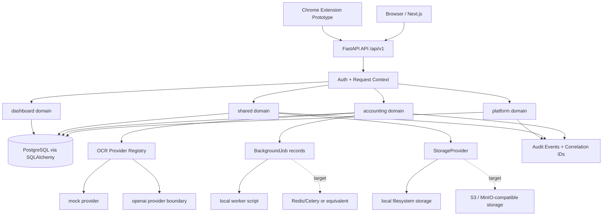

# Architecture: Accounting OCR Platform

Last updated: 2026-05-29

## 1. Executive Summary

Accounting OCR Platform is a modular document intake, OCR, human review and
export platform for accounting service teams. The source code currently
implements a FastAPI backend, a Next.js frontend, a Chrome extension prototype,
database migrations, tests and architecture/planning documentation.

The current codebase should be treated as a modular monolith MVP. It already has
clear bounded contexts, tenant-scoped repositories, upload validation, OCR
provider abstraction, lifecycle policies, field-level OCR result contracts,
export templates, audit events and a reviewer queue UI shell. It is not yet a
production-ready deployment because authentication is still demo-friendly,
workers/storage are local, reviewer correction UI is incomplete, export artifact
download is simplified, and some list/admin APIs still need stronger pagination
and aggregate-query hardening.

## 2. Current Source State

### Repository Layout

```text
backend/       FastAPI app, SQLAlchemy models, Alembic migrations, tests, worker script
frontend/      Next.js app for intake, dashboard, review queue, admin and AI pages
extension/     Chrome extension prototype for page/region OCR capture
docs/          Architecture, API contract and implementation plan
infra/         Placeholder for future infrastructure code
scripts/       Placeholder for project-level scripts
```

### Implemented Runtime Components

- Backend API: FastAPI app mounted under `/api/v1`.
- Frontend app: Next.js app router with pages for overview, dashboard,
  accounting intake, accounting review queue, AI and admin.
- Database layer: SQLAlchemy async models and Alembic migrations.
- Auth context: bearer JWT support plus demo header fallback.
- Tenant model: `organization_id` propagated through request context and
  repository filters.
- Upload path: multipart upload with server-side size, MIME, extension and file
  signature validation.
- File storage: local filesystem provider behind `StorageProvider`.
- Duplicate detection: per-tenant file content hash support.
- OCR: provider registry with mock and OpenAI-capable provider boundary.
- Review contract: OCR result exposes both legacy `fields` and `field_items`
  with stable field IDs.
- Export: JSON, MISA-style CSV and FAST-style CSV template serializers.
- Audit/traceability: audit events, HTTP trace ID middleware and correlation IDs
  for OCR/background/export flows.
- Test suite: backend non-integration tests for lifecycle, contracts, upload
  validation, duplicate handling, correlation IDs, exports, permissions and
  platform boundaries.

### Known Local Artifacts

- `frontend/node_modules/` and `frontend/.next/` may exist locally after install
  and build, but are ignored by git.
- `.github/workflows/` is ignored because the current GitHub token cannot push
  workflow files without `workflow` scope.

## 3. High-Level Architecture



## 4. Solution Feature Requirements

This section maps the architecture to business outcomes, compliance needs and
operational acceptance criteria. It is intentionally written as a portfolio-level
solution architecture view, not only a module inventory.

## Feature: Client Company Management

### Business Description

Allows an accounting service organization to manage the client companies whose
documents, invoices and accounting periods are processed in the platform.

### Job To Be Done (JTBD)

**When** an accounting service team receives work from a new or existing client
company

**I want** a tenant-scoped client-company record with tax and identity metadata

**So that** uploaded documents, OCR results, review queues and exports can be
organized by the correct client relationship.

### Compliance & Standards

- Tenant isolation.
- RBAC for create/update operations.
- Audit trail for client-company mutations.
- Unique client tax code policy per organization.

### Acceptance Criteria

- Admin or employee can create a client-company record.
- Client-company list only returns records for the current organization.
- Duplicate tax code handling is scoped to the organization.
- Document upload requires a client-company association.
- Client-company APIs do not accept caller-supplied organization ownership.

### Non-Functional Requirements

- Client-company list must be bounded before production-scale rollout.
- Common lookup by `organization_id` and `tax_code` must be indexed.
- Read latency target: P95 < 300ms for normal tenant workloads.
- Write latency target: P95 < 700ms excluding database cold starts.

### Architecture Ownership

- Backend owner: `app.domains.accounting.client_company_service`.
- Data owner: `AccountingClientCompany`.
- API owner: `/api/v1/accounting/client-companies`.
- Frontend owner: accounting intake surfaces.

## Feature: Accounting Document Intake

### Business Description

Allows users to upload invoices and supporting accounting documents with client,
period, type and category metadata.

### Job To Be Done (JTBD)

**When** an accounting team receives a document for processing

**I want** to upload it with safe metadata validation and duplicate detection

**So that** OCR and review workflows start from trusted, tenant-scoped records.

### Compliance & Standards

- Tenant isolation.
- RBAC for upload and document creation.
- Upload size, MIME, extension and file signature validation.
- Safe filename policy.
- Duplicate file detection by content hash.
- Audit trail without raw file bytes.

### Acceptance Criteria

- Admin or employee can upload PDF, JPEG or PNG documents.
- Oversized files are rejected server-side.
- MIME/extension/signature mismatches are rejected.
- Duplicate file content returns a conflict within the same organization.
- Stored file paths are derived from safe IDs and sanitized filenames.
- Created documents include file asset metadata and initial lifecycle state.

### Non-Functional Requirements

- Max upload size is bounded by configuration.
- Upload reading must remain chunked and memory-aware.
- Storage provider must be replaceable without changing accounting services.
- Upload rejection should fail before any accounting document row is created.

### Architecture Ownership

- Backend owner: `AccountingDocumentService`, `FileService`.
- Storage owner: `StorageProvider`, `LocalStorageProvider`.
- Data owner: `AccountingDocument`, `FileAsset`.
- API owner: `POST /api/v1/accounting/documents/upload`.
- Frontend owner: `frontend/app/accounting/create-document-form.tsx`.

## Feature: OCR Job Processing

### Business Description

Creates OCR jobs for uploaded accounting documents, executes OCR through a
provider boundary and persists normalized extraction results.

### Job To Be Done (JTBD)

**When** a document is ready for extraction

**I want** OCR processing to run through a controlled provider abstraction

**So that** the platform can switch between mock, OpenAI or future providers
without changing review and export workflows.

### Compliance & Standards

- Provider registry and fail-closed unknown provider behavior.
- State machine governance for document and OCR job transitions.
- Correlation ID propagation.
- Audit trail for request, completion and failure.
- Raw provider payload is backend diagnostic data only.

### Acceptance Criteria

- OCR request creates an OCR job and a background job record.
- OCR execution resolves provider through the registry.
- Invalid provider names fail closed.
- OCR completion creates result and field rows.
- OCR failure moves job and document to predictable failed states.
- Normal OCR result API does not expose raw provider payload.

### Non-Functional Requirements

- OCR jobs must carry enough context to execute outside request scope.
- Job records must include attempts and correlation ID.
- Future durable worker implementation must support retries and idempotent
  claiming.
- External provider timeout/failure must not leave invalid lifecycle state.

### Architecture Ownership

- Backend owner: `AccountingOcrService`.
- Provider owner: `ocr_provider.py`.
- Job owner: `BackgroundJobService`.
- Data owner: `AccountingOcrJob`, `AccountingOcrResult`,
  `AccountingOcrField`, `BackgroundJob`.
- API owner: OCR job request and execute endpoints.

## Feature: Reviewer Queue And Field Correction

### Business Description

Allows reviewers to find documents needing human validation, inspect extracted
fields, correct values and approve OCR results.

### Job To Be Done (JTBD)

**When** OCR confidence is low or accounting fields require validation

**I want** a reviewer queue and field-level correction workflow

**So that** only verified accounting data moves to approval and export.

### Compliance & Standards

- Tenant isolation.
- RBAC for field updates and approval.
- State machine governance for OCR result and document approval.
- Field-level audit metadata.
- DTO contract exposing field IDs and excluding raw OCR payload.

### Acceptance Criteria

- Reviewer queue loads `needs_review` documents from a bounded API query.
- Queue supports client-company and accounting-period filters.
- Selecting a document loads OCR result detail.
- OCR result includes `field_items` with `id`, `key`, `value`, `confidence`
  and `source`.
- Field update endpoint records manual correction source and audit event.
- Invalid cross-tenant field/result IDs are not exposed.
- Approval is rejected for invalid lifecycle transitions.

### Non-Functional Requirements

- Review queue must not fetch all documents and filter only in the browser.
- Default queue page size must be bounded.
- Field detail payload must exclude raw provider payload.
- Target queue read latency: P95 < 500ms for normal tenant workloads.
- Future correction history should support pagination.

### Architecture Ownership

- Backend owner: `AccountingOcrService`, `AccountingDocumentRepository`.
- Data owner: `AccountingOcrResult`, `AccountingOcrField`,
  `AccountingDocument`.
- API owner: document list, OCR result, field update and OCR approval endpoints.
- Frontend owner: `frontend/app/accounting/review`.

## Feature: Export Batch Management

### Business Description

Allows approved accounting documents to be grouped and exported in accounting
system-friendly templates.

### Job To Be Done (JTBD)

**When** reviewed documents are ready for downstream accounting systems

**I want** to export approved records in a controlled template

**So that** accounting teams can transfer verified data without manual
reformatting.

### Compliance & Standards

- RBAC for export creation and download.
- Tenant isolation for all exported documents.
- Approved-only export policy.
- Export template allowlist.
- Spreadsheet formula injection protection.
- Audit trail for export batch creation.

### Acceptance Criteria

- Export rejects unknown template names.
- Export rejects non-approved documents.
- Export batch is tenant-scoped and correlated.
- Export items are recorded per document.
- JSON, MISA-style CSV and FAST-style CSV serializers are isolated from HTTP
  routing.
- CSV cells that could execute formulas are escaped.

### Non-Functional Requirements

- Small exports may run synchronously only while bounded.
- Large exports must move to background jobs.
- Export generation should avoid N+1 document fetches before production scale.
- Download should become a file response or expiring object-storage reference.

### Architecture Ownership

- Backend owner: `AccountingExportService`.
- Template owner: `export_templates.py`.
- Data owner: `AccountingExportBatch`, `AccountingExportItem`.
- API owner: `/api/v1/accounting/export-batches`.

## Feature: Dashboard And Operational Analytics

### Business Description

Provides role-aware operational visibility into document intake, OCR workload,
review workload, export status and audit activity.

### Job To Be Done (JTBD)

**When** an operator or administrator opens the platform

**I want** to see the most important accounting workflow metrics

**So that** I can prioritize queue work, detect failures and monitor throughput.

### Compliance & Standards

- Tenant isolation.
- Role-based visibility.
- Read-only dashboard access.
- Safe aggregation without raw document or OCR payloads.

### Acceptance Criteria

- Dashboard metrics are scoped to current organization.
- Dashboard does not expose raw OCR provider payload or file content.
- Metrics cover document status, OCR queue/failure state, review workload and
  exports as the product matures.
- Admin-only operational data is not visible to lower roles.

### Non-Functional Requirements

- Dashboard target load time: < 1s for normal tenant workloads.
- Aggregate SQL queries should be used instead of row-by-row processing.
- Dashboard endpoints must avoid unbounded list loading.

### Architecture Ownership

- Backend owner: `app.domains.dashboard`.
- Data owners: accounting, shared and platform aggregate sources.
- Frontend owner: `frontend/app/dashboard`.

## Feature: Admin And Security Management

### Business Description

Allows administrators to manage users, observe audit events and control access
to platform capabilities.

### Job To Be Done (JTBD)

**When** the organization adds staff or changes responsibilities

**I want** centralized user, role and audit management

**So that** access remains least-privilege and privileged actions remain
traceable.

### Compliance & Standards

- RBAC.
- Least privilege.
- Tenant isolation.
- Audit logging for privileged operations.
- JWT-based authentication target.
- Demo authentication must be local/development-only.

### Acceptance Criteria

- Admin can list users in the current organization.
- Admin can create user records.
- Admin can request password reset.
- Admin can view audit events for the current organization.
- Non-admin roles are rejected from admin endpoints.
- Organization listing is DB-backed and scoped to current context.

### Non-Functional Requirements

- 100% of privileged actions must be auditable before production.
- Audit lists must add explicit pagination before production scale.
- Production authentication must fail closed without a valid bearer token.
- Secret and JWT configuration must be environment-managed.

### Architecture Ownership

- Backend owner: `app.domains.platform`.
- Auth owner: `app.core.context`, `app.core.session`,
  `auth_membership_service.py`.
- Data owner: `User`, `Role`, `Membership`, `AuditEvent`.
- Frontend owner: `frontend/app/admin`.

## Feature: Region OCR Extension Workflow

### Business Description

Provides a prototype path for capturing selected page or screen regions and
sending them to the backend for OCR extraction.

### Job To Be Done (JTBD)

**When** a user needs OCR from a selected region rather than a full uploaded
document

**I want** a browser-assisted region capture workflow

**So that** ad hoc document snippets can be extracted without disrupting the
main intake pipeline.

### Compliance & Standards

- Tenant isolation.
- RBAC for region OCR endpoint.
- Explicit region bounding boxes.
- Audit metadata without raw sensitive content by default.

### Acceptance Criteria

- Chrome extension prototype loads popup, background and content scripts.
- Backend accepts region OCR requests for a tenant-scoped document.
- Region request includes page and bounding box coordinates.
- Region OCR response returns text, confidence and box metadata.

### Non-Functional Requirements

- Region OCR should remain bounded by number of regions per request before
  production.
- Browser extension package requires separate security review before release.
- Region OCR should reuse OCR provider boundaries where practical.

### Architecture Ownership

- Backend owner: `RegionOcrService`.
- API owner: `POST /api/v1/accounting/documents/{document_id}/region-ocr`.
- Extension owner: `extension/chrome`.

## 5. Bounded Contexts

### `app.core`

Current responsibilities:

- Runtime settings in `config.py`.
- Async database engine/session wiring in `database.py`.
- Auth principal, request context, role and permission dependencies.
- JWT encode/decode helpers in `session.py`.
- Local storage provider and upload validation in `storage.py`.
- Trace ID middleware and request logging in `observability.py`.
- Shared repository and model mixins.

Current limitations:

- Settings are a plain Pydantic `BaseModel`, so environment loading is limited.
- Demo header auth is always available when bearer auth is absent.
- Local storage is the only implemented storage provider.

Architecture rule:

- `app.core` remains domain-neutral and must not import accounting/platform
  services.

### `app.domains.platform`

Current responsibilities:

- Organizations, users, memberships, roles, permissions, audit and login models.
- Google SSO verification modes and auth callback.
- Membership-to-auth-principal resolution.
- Admin user listing, creation and password reset request audit.
- Organization list endpoint backed by current authenticated organization.
- Audit event listing through admin service.

Current limitations:

- Demo auth remains suitable for local development only.
- Admin audit event list currently returns a simple `ListResponse` and still
  needs bounded pagination parameters.
- Password reset is an audited request stub, not a full email/token flow.

### `app.domains.shared`

Current responsibilities:

- `FileAsset` model with content hash and per-tenant hash uniqueness.
- File asset creation with upload validation, safe filename normalization,
  storage key generation and duplicate-file rejection.
- `BackgroundJob` model with status, payload, attempts, error message and
  correlation ID.
- Background job lifecycle service and audit events.

Current limitations:

- Background jobs are database records plus a local worker script, not a durable
  distributed queue.
- File storage is local filesystem only.
- Background job idempotency metadata is not fully modeled yet.

### `app.domains.accounting`

Current responsibilities:

- Client company CRUD basics.
- Accounting document metadata creation and multipart upload.
- Document list with tenant scope, filters and bounded offset pagination.
- Document lifecycle transition service.
- OCR job request and execution.
- OCR provider registry lookup.
- OCR result and field persistence.
- OCR field update endpoint and audit event.
- OCR result approval endpoint.
- Export batch creation and simplified download.
- Export templates for `json`, `misa` and `fast`.
- Region OCR endpoint.

Current limitations:

- OCR job execution is still exposed through an API endpoint and local worker
  pattern; production should claim jobs from a durable queue.
- Reviewer UI can inspect OCR fields but does not yet provide the complete
  field editing/approval workbench.
- Export creation currently loops through document IDs and download returns a
  simplified JSON payload rather than a generated file response or stored
  artifact reference.
- Invoice identity fields exist on documents, but extraction-to-document
  promotion and post-OCR duplicate policy are not fully implemented.

### `app.domains.dashboard`

Current responsibilities:

- Dashboard router and service for tenant-scoped accounting metrics.

Current limitations:

- Dashboard aggregation needs continued review to ensure all metrics use bounded
  aggregate SQL rather than unbounded row loading as data volume grows.

## 6. Frontend Architecture

The frontend is a Next.js application using the app router and a compact
operational UI style.

Current routes:

- `/`: overview shell.
- `/dashboard`: dashboard page.
- `/accounting`: intake list and upload form.
- `/accounting/review`: review queue with client/period filters, selected
  document state and OCR field preview.
- `/ai`: AI/OCR surface placeholder.
- `/admin`: admin surface placeholder.

Current API client behavior:

- Uses `NEXT_PUBLIC_API_BASE_URL`, defaulting to `http://localhost:8000/api/v1`.
- Sends demo headers by default for local development.
- Supports `GET`, `POST`, `PATCH` and multipart form POST.
- Has accounting helpers for document list filters, upload, review queue,
  OCR result fetch, OCR field update and OCR result approval.

Current limitations:

- API fetches do not yet use an explicit timeout or retry policy.
- Review queue filtering is partly client-side after the initial
  `needs_review` server-side query.
- Field correction and approval flows are implemented as API helpers but are not
  fully wired into the review UI.
- No frontend unit/E2E test harness is present yet.

## 7. Chrome Extension Prototype

The `extension/chrome` directory contains a prototype Chrome extension with:

- `manifest.json`.
- Background script.
- Content script and content styles.
- Popup HTML/CSS/JS.

Architectural status:

- Prototype only.
- Intended for future region OCR capture workflows.
- Not yet treated as a production browser extension package.

## 8. Data Model And Migrations

Alembic migrations currently include:

- `0001_schema_backbone.py`: core platform/shared/accounting schema backbone.
- `0002_duplicate_detection_fields.py`: content hash and invoice identity
  fields/indexes.
- `0003_correlation_ids.py`: correlation IDs for jobs, audit events, OCR jobs
  and export batches.

Important model state:

- `AccountingDocument` stores file hash and invoice identity fields.
- `FileAsset` stores content hash with tenant-scoped uniqueness.
- `AccountingOcrJob`, `BackgroundJob`, `AuditEvent` and
  `AccountingExportBatch` store correlation IDs.
- `AccountingOcrResult` stores raw provider payload for backend diagnostics,
  but normal reviewer DTOs do not expose it.

Migration rule:

- Any persistence change must update SQLAlchemy models, Alembic migrations,
  tests and seed/demo data when relevant.

## 9. API Surface

Base path: `/api/v1`.

Implemented accounting endpoints include:

- `GET /accounting/client-companies`
- `POST /accounting/client-companies`
- `GET /accounting/documents`
- `POST /accounting/documents`
- `POST /accounting/documents/upload`
- `POST /accounting/documents/{document_id}/ocr-jobs`
- `POST /accounting/documents/{document_id}/submit`
- `POST /accounting/documents/{document_id}/mark-needs-review`
- `POST /accounting/documents/{document_id}/approve`
- `GET /accounting/documents/{document_id}/ocr-result`
- `POST /accounting/ocr-jobs/{ocr_job_id}/execute`
- `PATCH /accounting/ocr-results/{result_id}/fields/{field_id}`
- `POST /accounting/ocr-results/{result_id}/approve`
- `POST /accounting/export-batches`
- `GET /accounting/export-batches/{batch_id}/download`
- `POST /accounting/documents/{document_id}/region-ocr`

Implemented platform endpoints include:

- `GET /me`
- `GET /organizations`
- `GET /admin/users`
- `POST /admin/users`
- `POST /admin/users/{user_id}/reset-password`
- `GET /admin/audit-events`

Current API contract strengths:

- Document list supports `status`, `client_company_id`, `accounting_period`,
  `limit` and `offset`.
- OCR result includes field IDs via `field_items`.
- Upload errors and domain errors use stable `code` fields.

Current API contract gaps:

- Most `ListResponse` payloads include `items` only, without `total`, `limit`,
  `offset` or `next_cursor` metadata.
- Admin audit and user lists still need explicit pagination.
- Export download endpoint is not a true file download endpoint yet.

## 10. Lifecycle Policies

Lifecycle policy is implemented in `app.domains.accounting.lifecycle`.

### Accounting Document

```text
uploaded -> queued -> processing -> needs_review -> approved -> exported
uploaded -> failed
queued -> failed
processing -> failed
needs_review -> failed
```

### OCR Job

```text
queued -> processing -> completed
queued -> processing -> failed
failed -> queued
```

### OCR Result

```text
needs_review -> approved
needs_review -> rejected
```

### Export Batch

```text
queued -> processing -> completed
queued -> processing -> failed
completed -> downloaded
```

Current implementation note:

- Small export creation currently creates a batch as `queued` and transitions it
  directly to `completed` in the same service call.

## 11. Security State

Implemented controls:

- Tenant-scoped repository access by `organization_id`.
- Role dependencies for privileged accounting/admin operations.
- Upload size limit in stream reader and validation layer.
- MIME, extension and file signature validation for PDF/JPEG/PNG.
- Safe filename normalization.
- Local storage path traversal guard.
- Per-tenant duplicate content hash rejection.
- Spreadsheet formula injection mitigation in CSV export templates.
- Raw OCR provider payload excluded from normal OCR result DTO.
- Audit events for important domain actions.
- Correlation IDs across OCR, background job, audit and export records.

Known security gaps:

- Demo header auth must be disabled or strictly environment-gated for
  production.
- Secrets are represented by local defaults and need production secret
  management.
- CORS and deployment host restrictions are not documented as production-ready.
- Audit/event payload classification is not fully formalized.
- Admin audit list needs pagination and safe metadata review at scale.

## 12. Performance And Reliability State

Implemented controls:

- Document list has bounded `limit` with server-side max of 100.
- Common document filters are represented in model indexes.
- Upload reading is chunked and rejects oversized payloads.
- Background job records include attempts and status.
- OCR provider lookup fails closed for unknown providers.

Known performance/reliability gaps:

- Export service currently fetches documents one by one.
- Export artifacts are not stored or streamed as files yet.
- Local worker is not durable and has no distributed locking/claiming strategy.
- Frontend API calls need timeout handling to avoid SSR/client hangs when the
  backend is unavailable.
- Dashboard and admin list endpoints need continued aggregate-query and
  pagination hardening.

## 13. Observability State

Current:

- HTTP trace ID middleware.
- Structured request logging.
- Audit events for document creation, status changes, OCR request/completion/
  failure, field updates, exports, admin actions and background job changes.
- Correlation ID columns on core async/audit entities.

Target:

- Standardize event catalog and metadata classification.
- Include correlation IDs consistently in worker logs.
- Add dashboard metrics for OCR queue depth, OCR failures, review workload,
  export volume and audit volume.

## 14. Testing State

Current backend tests cover:

- Permission helpers.
- Trace ID middleware.
- Accounting lifecycle policies.
- OCR result API contract.
- Document list filters and tenant-scoped query contract.
- OCR provider registry.
- File service duplicate detection.
- Upload validation.
- Export templates and CSV escaping.
- Platform router DB-backed organization boundary.
- Correlation ID contracts.
- Database metadata contract as an integration-marked test.

Latest known verification from this development session:

```bash
cd backend
python3 -m pytest app/tests -q -m 'not integration'
# 36 passed, 1 deselected

cd frontend
npm run lint
npm run build
# completed successfully
```

Testing gaps:

- No frontend unit test suite yet.
- No Playwright/E2E coverage yet.
- No full Docker Compose smoke test recorded in this architecture file.
- No production database migration test pipeline in repository CI, because CI
  workflow files could not be pushed with the current token scope.

## 15. Current ADRs

### ADR-001: Modular Monolith First

- Decision: Keep one FastAPI modular monolith with explicit domain packages.
- Reason: The product is domain-rich but not large enough to justify
  microservices yet.
- Impact: New backend code should fit `core`, `platform`, `shared`,
  `accounting` or `dashboard`.

### ADR-002: Local Worker Now, Durable Queue Later

- Decision: Use database-backed background job records and local worker scripts
  for MVP; keep a queue boundary for future Redis/Celery or equivalent.
- Impact: Job handlers must not depend on request scope and should move toward
  idempotent retry-safe execution.

### ADR-003: Storage Provider Boundary

- Decision: Keep `StorageProvider`; local filesystem is current implementation,
  S3/MinIO-compatible storage is target production implementation.
- Impact: Domain services should depend on `StorageProvider`, not raw filesystem
  or object-storage SDKs.

### ADR-004: OCR Provider Registry

- Decision: Resolve OCR providers through a registry/factory boundary.
- Impact: Unknown provider names fail closed; provider payloads stay backend-only
  unless a safe diagnostic endpoint is explicitly designed.

### ADR-005: Export Serializer Boundary

- Decision: Keep export template serializers separate from lifecycle and HTTP
  routing.
- Impact: Adding export formats should be isolated to serializer contracts and
  tests.

## 16. Open Architecture Gates

These are the current gates after reading the source state:

- Production auth gate: disable or environment-gate demo header auth.
- Durable worker gate: replace local worker path with a claimable durable queue
  strategy before production OCR volume.
- Object storage gate: add S3/MinIO provider and private object access policy.
- Review UI gate: complete field editing, save states, approval action and
  correction history UI.
- Export gate: return real export artifacts or expiring download references;
  avoid N+1 document fetches.
- Pagination gate: add metadata and bounded pagination to admin/audit/client
  list endpoints.
- Frontend reliability gate: add fetch timeout/error handling for SSR and client
  calls.
- CI gate: add workflow once repository token has `workflow` scope.
